# FinanceVault — Interview Answers

**Repository:** https://github.com/ShrutiBora001/FinanceVault

This document answers 32 system-design and ownership questions about FinanceVault. Where a
real story exists, the answer is told STAR-style (Situation, Task, Action, Result). Every
number here comes from the repo: `report/financevault_v0.2.md`, `report/mvp1.md`,
`eval/results/*.json`, and the code itself. Where something is not built or not measured, the
answer says so and then gives the design I would defend.

**How to read the labels**

| label | meaning |
|---|---|
| **[Built]** | exists in the code and is exercised by tests or runs |
| **[Measured]** | a number backed by a committed results file or report table |
| **[Not built: design]** | an honest "we haven't done this", followed by how I would do it |

Answers do not repeat each other. When a concept was explained earlier, the answer points
back to it ("see Q7") instead of explaining it again.

---

## Part 0 — The project in two minutes

### What problem it solves

Say someone asks: *"What was Apple's net profit margin in fiscal 2018?"* To answer it
properly you have to:

1. find the right filing,
2. pull the right number (net income, not operating income),
3. check it covers the right period (the full year, not the fourth quarter),
4. check its unit (dollars, not thousands of dollars),
5. do the division,
6. say where the numbers came from.

A normal chatbot guesses. A "RAG" system (retrieve some passages, then answer) handles step 1
and guesses the rest. Tool-using AI agents do better, but they are graded only on whether
the final answer is right. That tells you nothing about *which* step went wrong.

Finance makes this harder in two ways:

- **Numeric errors are silent.** "$112 million" when the truth is "$112 billion" reads just as
  fluently as the right answer.
- **Financial data has a time dimension.** If you ask "what did we know on 1 October 2025?",
  a careless system will use a report that wasn't published until 31 October. That's called
  **lookahead bias**, and it makes backtests and benchmarks look better than they are.

### What I built

FinanceVault is a **test environment and measurement system for financial AI agents**. It is
built on public SEC data (EDGAR filings and XBRL, the machine-readable financial tags inside
filings). It has four core pieces:

1. **A point-in-time data store.** Every row carries the moment it became public. The database
   itself refuses to show an agent anything published after the question's date (Q7).
2. **An agent runtime.** A router picks one of five execution paths (Q10). A step executor
   runs a bounded plan → act → observe loop over five typed tools (Q11). A budget ledger
   stops runaway runs (Q12).
3. **A five-signal step verifier.** It scores *every step* of a run, not only the final
   answer (Q16).
4. **A content-addressed journal.** Every model call is recorded under a hash of its exact
   request, so a whole evaluation sweep can be replayed for $0.00, byte for byte (Q24).

The research question behind it is **H1**: *does training a model only on runs where every
step checks out beat training on runs that merely got the right final answer?* The
environment, benchmark and baselines are done. The H1 training experiment is not done yet
(Q18).

### Glossary (used throughout)

| term | plain meaning |
|---|---|
| **as_of** | the "information horizon": the instant the question is asked from. Nothing published later may be used. |
| **accepted_at** | the SEC acceptance timestamp: the moment a filing became public. This is the point-in-time key. |
| **XBRL fact** | one tagged number from a filing, e.g. `NetIncomeLoss = 112,010,000,000 USD` for the year ending 2025-09-27 |
| **trajectory** | the full record of one agent run: every thought, tool call and tool result |
| **step** | one tool call inside a trajectory (Q16) |
| **journal** | the table that stores every model request and response, keyed by a hash |
| **list cost vs. actual cost** | what a run *would* cost on a cold cache vs. what it *did* cost (cache hits are free) |
| **B0–B3** | baseline policies: B0 no tools, B1 single-shot RAG, B2 agent on Haiku 4.5, B3 same agent on Sonnet 5 |
| **D1 / D2 / D3 / E1 / E2** | accuracy / unsupported-claim rate / step-pass rate / cost per correct answer / latency |

### Diagram A — the whole system

Later answers refer back to this diagram.

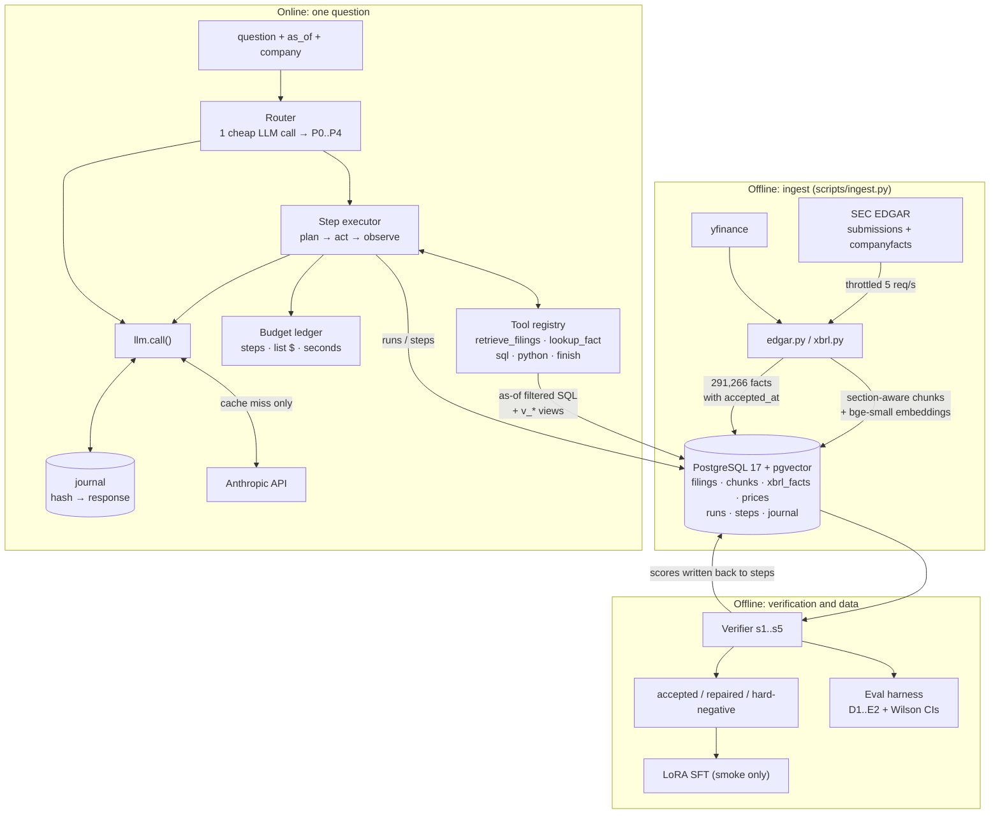

### The numbers you will be asked about

All measured on the **30-question dev split** (report v0.2, `eval/results/mvp2.2_dev.json`),
unless marked otherwise.

| policy | D1 accuracy | 95% CI | D2 unsupported | D3 step pass | E1 $/correct | mean steps |
|---|---|---|---|---|---|---|
| B0 Haiku, no tools | 10.0% | 3.5–25.6% | 16.7% | 0.0% | $0.0085 | 1.00 |
| B1 single-shot RAG | 6.7% | 1.9–21.3% | 0.0% | 6.7% | $0.0478 | 2.00 |
| B2 Haiku + tools | **76.7%** | 59.1–88.2% | 2.1% | 61.5% | $0.0273 | 4.33 |
| B3 Sonnet 5 + tools | **93.3%** | 78.7–98.2% | 1.1% | 64.4% | $0.0406 | 3.37 |

**Resume numbers vs. what the repo can back up.** Check this table before the interview:

| resume claim | what the repo supports | verdict |
|---|---|---|
| "8.5× accuracy" | B0 → B2 is 10% → 76.7% = **7.7×** (same model, tools added). B0 → B3 is 10% → 93.3% = **9.3×**. 85% ÷ 10% = 8.5× only works by mixing MVP1's B2 (20 Apple questions) with v0.2's B0 (30 dev questions). Those are different populations. | Change to "10% → 77% on the same model (7.7×)" or "→ 93% with a frontier model". See Q20. |
| "90% fewer unsupported claims" | 16.7% → 2.1% (B2) is **−87%**. 16.7% → 1.1% (B3) is **−93%**. | "~90%" is defensible if you name the model. See Q21. |
| "10% and 25% gains" | The closest match is the accuracy change after the measurement fixes in Q12: B2 66.7% → 76.7% (**+10.0 points**), B3 70.0% → 93.3% (**+23.3 points**). These are *percentage points* from fixing the *environment*, not model improvements. | Only use it if that is the source, and say "points". See Q22. |
| "3× cheaper per correct answer" | Not in any results file. Real figures: B2 is **1.5×** cheaper per correct answer than B3, and **1.75×** cheaper than B1. Haiku is 3× cheaper *per token* than Sonnet, but only 38% cheaper per answer in the one-question test. | Not defensible as written. See Q23. |

**One inconsistency in the report to know about.** §8 of the v0.2 report says unsupported
claims were "1.1% (B2) and 1.7% (B3)". The table and the JSON say **2.1% (B2) and 1.1% (B3)**.
The JSON is the source of truth, and this document uses it.

---

## Q1. What does FinanceVault do? Walk through one request.

**The one-liner.** It's an environment where an AI agent answers financial questions using
SEC data. It guarantees the agent can't see the future, it checks every step the agent takes,
and every run can be replayed for free.

### A real request, stage by stage [Built] [Measured]

This is an actual run from the MVP1 debugging log. It's a good example because the agent
made a mistake, recovered, and the verifier caught the mistake.

> **Question:** "What was AAPL's net income in fiscal year 2025?"
> **as_of:** 2025-11-01 · **company:** CIK 320193 (Apple) · **expected answer:** $112,010,000,000

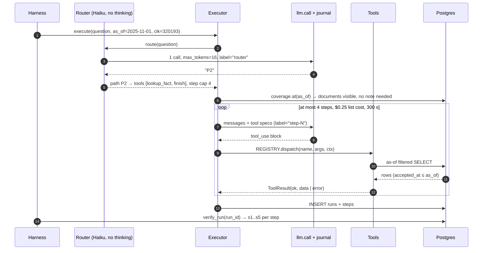

| stage | input | what happens | output | deterministic? |
|---|---|---|---|---|
| 1. Router | the question text | one Haiku call against a fixed rubric (Q10). Thinking off, `max_tokens=16`. | `"P2"`, which means one reported figure | **Model decision** |
| 2. Path setup | P2 | the toolset shrinks to `lookup_fact` and `finish`. The step cap becomes `min(12, 4) = 4`. | 2 tool specs sent to the model | Deterministic |
| 3. Coverage check | as_of | counts the documents and facts visible at this horizon (Q12). None are missing, so no note is added. | an empty note | Deterministic |
| 4. Step 0 | prompt + specs | the model calls `lookup_fact` with a tag or arguments that match nothing | `ERROR: no fact for tag=… Try a different tag; similar available tags: …` | the model picks the args; the tool is deterministic |
| 5. Step 1 | the error message | the model reads the suggested tags and calls `lookup_fact(tag="NetIncomeLoss")` | up to 20 rows, newest period first, and within a period the newest acceptance first | the tool is deterministic |
| 6. Step 2 | the rows | the model calls `finish(answer="…$112.010 billion", citations=[{kind:"fact", ref:"NetIncomeLoss", accession:…}], value=112010000000, unit="USD")` | run outcome `ok` | **Model decision** |
| 7. Persist | the run | one `runs` row, and one `steps` row per tool call | a UUID run id | Deterministic |
| 8. Verify | stored steps | five signals per step (Q16) | the table below | s1, s3, s5 programmatic; s2, s4 judged by a model |

What the verifier said about this run:

| step | tool | s1 validity | s2 citation | s3 numeric | s4 relevance | s5 answer | passes? |
|---|---|---|---|---|---|---|---|
| 0 | lookup_fact | 0.50 (valid call, tool errored) | n/a | n/a | **0.00** | n/a | **no** |
| 1 | lookup_fact | 1.00 | n/a | n/a | 1.00 | n/a | yes |
| 2 | finish | 1.00 | 1.00 | 1.00 | n/a | 1.00 | yes |

That table is H1 in miniature. An *outcome* filter keeps all three steps for training, because
the answer was right. A *step* filter keeps two of three and cuts the wasted lookup.

The same question on Sonnet 5 took 2 steps (3 model calls including the router), cost
$0.0176, and took 6.76 s. Replayed from the journal, it cost **$0.00** and took **0.04 s**.

### Where a plausible but wrong answer can sneak in

Each of these is a real failure class I either hit or built a check for:

1. **Wrong route.** If the router picks P2 for a delta question, the agent has no `python`
   tool and does the arithmetic in its head. (Q10)
2. **Wrong tag.** `Revenues` vs. `RevenueFromContractWithCustomerExcludingAssessedTax`. Both
   exist, and they differ by company and year.
3. **Wrong period.** A 10-K reports the full year *and* the fourth quarter, and they can share
   an end date. Apple's FY2018 and Q4-2018 both end 2018-09-29. This exact confusion broke
   my own ground truth once (Q20).
4. **Wrong scale.** Writing "$112.01 million" for $112.01 billion. s3 catches this against
   structured evidence (Q16).
5. **Arithmetic from memory.** The prompt forbids it. s3 checks that stated values trace back
   to a tool output.
6. **Numbers from the model's memory.** The model may simply "know" Apple's FY2025 income.
   s3 labels that `uncited`: the number is on record but the run never retrieved it (Q16).
7. **The ground truth itself.** Answers are generated from the same XBRL facts the agent can
   see, so the benchmark is somewhat circular (Q17, Q20).

### What I'd cut for a simpler first version

I'd keep only what protects correctness: as-of filtering, `lookup_fact`, `python`, `finish`,
the budget ledger, and the journal. I'd **cut** the router (always use one path), the
cross-encoder reranker, the SQL tool, and the LLM-judged signals s2 and s4. That version
answers every lookup, delta and ratio question in the benchmark. The benchmark is all
numeric and built from XBRL, so free-text retrieval barely matters: B1 RAG scored 6.7%.
The router and reranker earn their place only once narrative questions exist. The
SQL tool is the riskiest component I have (Q31), which is one more reason to leave it out of
a v0.

---

## Q2. What did you personally implement? What was hardest?

**Ownership.** I built FinanceVault alone. The git history is one author across 25 commits
and 3 merged PRs. That includes the schema, ingest, as-of layer, tools, router, executor,
ledger, journal, verifier, eval harness, benchmark generator, calibration benches, and
reports. So the useful question is which parts were *hard*, not which parts were mine.

### A module I'd name: `verify/numeric.py` (the s3 numeric-correctness signal)

- **Job:** take a final answer and decide whether every dollar figure in it traces back to
  evidence the run *actually retrieved*. Each claim gets one of five labels: `exact`, `scale`
  (right digits, wrong magnitude), `period` (right number, wrong period), `uncited` (a real
  number the run never looked up), or `fabricated`.
- **Interface:**
  `score(answer, *, evidence, cik, as_of, period_end, stated_value) -> Signal(score, reason, threshold=1.0)`.
  Evidence comes from `collect_evidence(steps)`, which walks every successful tool
  observation, both structured `value` fields and numbers quoted in retrieved text.
- **Why it matters:** this one signal is the numerator of D2 (unsupported claims). It's also
  the reason the verifier can catch the "fluent but wrong by 1000×" error at all.

### The hardest bug (STAR): the verifier "verified" a number I made up

**Situation.** I had written s3 and a set of tests with deliberately wrong answers: a figure
off by 1000×, a made-up $77,777,777,777, and FY2025 numbers asked at a January 2025 horizon.
All three tests *failed by passing*. Each wrong answer scored 1.0.

**Task.** Work out why a checker built to catch fabrication was approving it, before any
trajectory data got filtered through it.

**Action.**

- *Hypothesis 1: tolerance too loose.* The tolerance was 0.5% relative. Tightening it would
  have helped a little but didn't explain the fabricated value. Rejected.
- *Hypothesis 2: bad claim extraction.* I checked the regex output. The claims were
  extracted correctly. Rejected.
- *Evidence:* I logged what each claim matched. `classify()` compared each value against
  **all 25,135 Apple facts in the database**. With that many values across every magnitude,
  almost any plausible number lands within 0.5% of *something*. $77,777,777,777 matched a
  real Apple fact.
- *Fix:* I changed the question the verifier asks. Instead of "does this number exist
  anywhere?" it now asks "did this number come from the evidence this run retrieved?".
  `collect_evidence` builds a per-run evidence set from tool observations. The whole fact
  table is now used only as a *diagnostic fallback*, to tell `uncited` apart from
  `fabricated`. Neither one counts as verified.
- *Verification:* I kept the random number as a permanent regression test,
  `test_a_random_number_collides_with_the_fact_universe`. It proves the collision is real,
  and that the new design scores it 0.0.

**Result.** The verifier went from "agrees with anything plausible" to a checker that
seeded-error calibration measured at **100% recall on every s3 error class, with a 0%
false-positive rate on 20 clean control runs** (`eval/results/b2_seeded.json`). Q17 covers a
caveat on one of those classes.

Two more s3 bugs, found the same way, each pinned by a regression test:

| symptom | cause | fix |
|---|---|---|
| A fully correct answer, "net income for fiscal year 2025 (period ended September 27, 2025) was $112.010 billion", scored **0.25** | the extractor treated `2025`, `27` and `2025` as money claims | claims now carry an `is_financial` flag. Years, day numbers after a month name, and ISO dates are excluded. |
| "$112,010,000,000 ($112.01 billion)" scored 0.67. The restatement was read as **negative** $112B | a leading `(` was treated as an accounting negative, like `$(2,500)` | a negative lookahead `\((?!\s*\$)` tells "paren outside the dollar sign" apart from "dollar sign outside the paren" |

The date bug matters more than it looks. Most correct financial answers mention their period.
Left in, step filtering would have *thrown away correct answers* and kept vague ones that
omit dates. The experiment would have been quietly rigged.

### Alternatives I rejected

| alternative | why I rejected it |
|---|---|
| An LLM judge for numeric correctness | Ask a model "is $416.2B Apple's revenue?" and it agrees with anything plausible, and plausible is exactly the failure mode. Numbers are checked with arithmetic. Only the soft signals (s2, s4) use a judge. |
| Averaging per-claim scores with a 0.5 pass threshold | Calibration found an answer stating a figure correctly *and* with a 1000× error scored 0.6. The corruption was **detected**, and the step still passed. s3's threshold is now **1.0**: "every figure traces" is an AND, not an average. |
| Strict scale checking for figures quoted in prose | Filing tables say "in millions" in a column header the extractor never sees. Strict checking would penalise correct unit conversions. The trade-off is written down: off-by-1000 detection is strong only against structured facts. |

### Which result connects to my work

- **D2, the unsupported-claim rate (16.7% → 2.1%/1.1%)** is computed *by* s3. That metric
  exists because of this module.
- **A1, the lookahead leak rate of 0.00%**, versus 17.24% for the obvious `period_end` filter,
  comes from the as-of design in Q7.

---

## Q3. What makes this a distributed backend?

**Honest framing.** It's a **small multi-process system with external dependencies**, not a
distributed service. No component is replicated, there is no message queue, and there is no
network API of my own yet (the `api/` package is empty). Calling it "distributed" on a resume
invites Q13–Q15. I'd rather describe it accurately and show I understand where the
boundaries are and why.

### What runs where [Built]

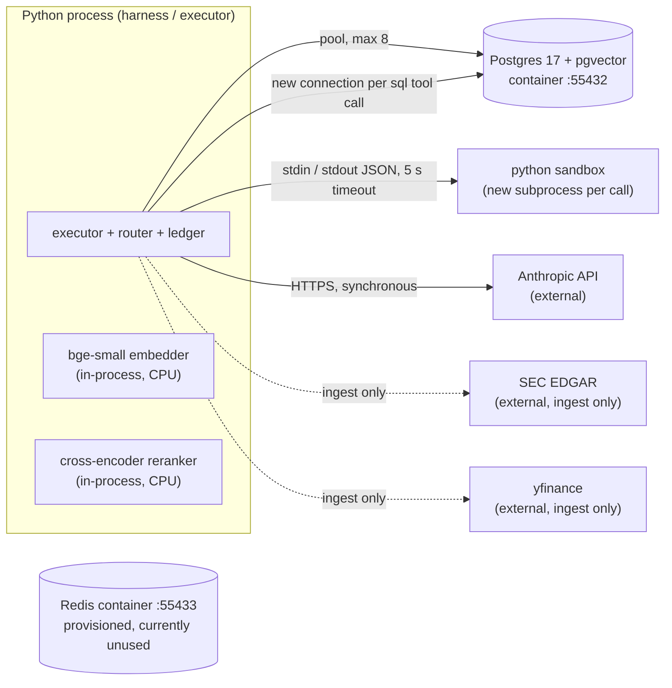

### Why these boundaries

| boundary | reason it exists |
|---|---|
| **Postgres as its own process** | It's the **trust boundary for the as-of guarantee**. The agent writes SQL, so the horizon has to be enforced *inside the database*, where Python can't be bypassed (Q7). |
| **Python sandbox as a subprocess** | The model writes code. Running it in my own interpreter would give it my DB connection and my filesystem. A child process with a stripped environment, `-I` isolated mode, rlimits and a timeout contains a runaway loop. It is not a security sandbox (Q31). |
| **Model API as an external service** | Not my choice to make. But everything goes through one function, `llm.call`, so journalling, cost accounting and replay happen in exactly one place. |
| **Embedder and reranker in-process** | Deliberately *not* split out: at this scale a network hop would cost more than the inference. Q30 covers when that changes. |

### Sync vs. async

Everything on the request path is **synchronous and sequential**: one question, one step at a
time, one tool call at a time. The only "async" part is structural, not queue-based.
**Verification is a separate pass**: signals in `steps` stay NULL until `verify_run` fills
them in. So generation and verification can each be re-run without the other, and
re-verification with an unchanged rubric is free because judge calls are journalled too.

### When one dependency fails

| failing dependency | what happens today | graceful? |
|---|---|---|
| **LLM judge** (s2/s4) | `judge.ask` catches everything and returns a neutral 0.5 with reason "judge unavailable" | **Yes**, by design |
| **Anthropic API** (agent) | the exception propagates and the sweep stops. Every call already completed is in the journal, so re-running resumes at $0 for the finished part. | Partial. It happened for real (Q15). |
| **SEC EDGAR** | only ingest fails. Serving never touches SEC. | **Yes** |
| **Postgres** | everything stops. It's the single point of failure. | No |
| **Sandbox timeout** | returns `execution exceeded 5s` as an observation, and the agent can recover | **Yes** |

### New failure modes that multiple components introduced

These are the interesting ones, because each one showed up as a *wrong number*, not an error:

1. **Non-deterministic ordering across the DB boundary breaks replay.** An unordered `SELECT`
   inside a tool changes the next prompt, which changes the journal key (Q24).
2. **Cache state changing behaviour.** A warm journal made the dollar ceiling disappear
   (Q12).
3. **Partial writes.** `runs` and `steps` are inserted on separate pooled connections, so a
   crash in between leaves a run with no steps (Q13).
4. **Partial ingest being visible** (Q6).

---

## Q4. Why PostgreSQL and pgvector?

**The deciding requirement was point-in-time enforcement on agent-written SQL, not vector
search.**

### Requirements that decided it [Built]

1. **Enforce the as-of horizon in the database.** Views filter on
   `current_setting('fv.as_of')`, a per-transaction session variable (Q7). A standalone
   vector database can filter by metadata, but it can't enforce a horizon on arbitrary SQL
   written by a model.
2. **One query joins vectors, full text and relational filters.** Retrieval needs "nearest
   chunks *whose filing* was accepted before as_of, in this section, this form". That's a
   JOIN between `chunks` and `filings`. In Postgres it's one statement.
3. **Hybrid retrieval in the same engine.** `tsvector` plus a GIN index covers the lexical
   side, and `pg_trgm` powers "did you mean `NetIncomeLoss`?" errors.
4. **Transactions and constraints.** `UNIQUE NULLS NOT DISTINCT` made ingest idempotent (Q6).
   `ON CONFLICT` made the journal first-write-wins (Q24).
5. **Scale.** 5,949 chunks, 291,266 facts. A separate vector system would be pure
   operational overhead at this size.

I also documented a deviation from my own plan. The plan said DuckDB for the SQL tool. I used
Postgres instead, because DuckDB would need either a runtime extension download or a table
copy per call, and **it can't enforce the horizon on agent SQL**.

### What gets slow as data grows

These are predictions from reading the query plans in the code, not load tests:

| query | why it degrades |
|---|---|
| **Filtered vector search** (`RETRIEVE_SQL` `vec` CTE) | The HNSW index finds nearest neighbours *first* and then the `WHERE` drops rows filtered out by as-of, section or form. With a tight filter (an old horizon, one section, one company) most candidates get discarded and fewer than 50 survive. Recall drops silently. At today's size the planner probably just scans everything. |
| **Full-text ranking** (`fts` CTE) | `ts_rank` is computed for *every* matching row before sorting. The GIN index finds matches but can't return the top k in order. Common words make this slow. |
| **`_exists_on_record`** in s3 | `value BETWEEN lo AND hi` for a company. There's no index on `value`, so it's a scan over that company's facts. |
| **`coverage.at`** per run | Three `count(*)`/`min`/`max` aggregates on every run. Cheap now, linear later. |
| **The `journal` table** | Grows forever. Lookups by primary key stay fast, but request/response JSONB bloats storage. |

### When I'd move retrieval out

Before migrating, I'd try the cheaper Postgres options first: pgvector iterative index scans
(0.8+), partial or partitioned indexes per company, or pre-filtering by filing id. I'd move
to a dedicated retrieval system when **all** of these hold:

- vectors in the tens of millions, *and*
- the retrieval span is a meaningful share of end-to-end p95, *and*
- filtered recall@k against exact search drops below a set bar, *and*
- vector search is competing with the agent's SQL for the same database CPU.

**Evidence that would justify it:** a trace showing retrieval's share of latency, a recall@k
comparison between HNSW and exact search on filtered queries, and Postgres CPU saturation
correlated with retrieval traffic. I have none of these today, because there's no tracing
(Q29) and no retrieval ground truth (Q8). So the honest answer is that Postgres is right for
now, and I know what I'd need to measure to change that.

---

## Q5. Describe your database schema.

Seven tables in `src/financevault/store/schema.sql`: four for the **environment**, three for
**trajectories**.

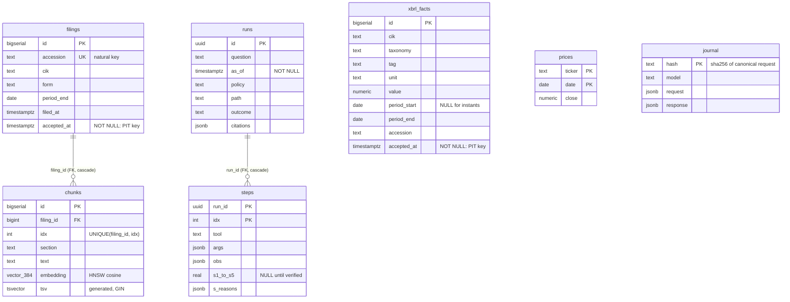

On top of that there are four **as-of views** (`v_filings`, `v_xbrl_facts`, `v_chunks`,
`v_prices`), which are the only things the SQL tool can name (Q7).

### What uniquely identifies each thing

| entity | identity | why |
|---|---|---|
| **Filing** | `accession` (SEC's accession number), `UNIQUE` | It's SEC's own permanent id. Ingest upserts on it. |
| **Financial fact** | `(accession, taxonomy, tag, unit, period_start, period_end)`, `UNIQUE NULLS NOT DISTINCT` | The same tag and period **is reported again in later filings** (the prior-year comparison column), so the accession has to be part of the key. Keeping every version is what makes restatements work (Q6). `NULLS NOT DISTINCT` matters because balance-sheet facts have no `period_start` (Q6 tells the bug). |
| **Chunk** | `(filing_id, idx)` | The position inside a filing. Deterministic given the chunker. |
| **Journal entry** | `hash` = SHA-256 of the canonical request | Content-addressed, so identical requests share a row (Q24). |
| **Step** | `(run_id, idx)` | The position in a trajectory. |

### Invariants enforced by the database

- `accepted_at NOT NULL` on `filings` and `xbrl_facts`. A row can never slip past an as-of
  filter by having no timestamp. At ingest, a fact whose acceptance time can't be found is
  **dropped, never guessed** (the count is 0 across 291,266 facts).
- Foreign keys with `ON DELETE CASCADE`: chunks → filings, steps → runs.
- The unique keys above, plus `prices (ticker, date)` as the primary key.
- **The fail-closed view predicate.** `current_setting('fv.as_of')` with no default *raises*
  when the variable is unset. That's an invariant enforced by Postgres semantics, not by my
  code.

**Enforced in Python, not the database** (a gap I'd close): signal scores in [0, 1]
(`Signal.__post_init__`), `runs.outcome` values, and `form` values. I'd add `CHECK`
constraints. And there's deliberately **no FK from `xbrl_facts.accession` to `filings`**:
facts come from about 17 years of filings, but only the last year's *documents* are
ingested (Q12).

### Normalise vs. JSON

- **Normalised columns** for everything the system queries or enforces: `tag`, `unit`,
  `value`, `period_*`, `accepted_at`. **Unit and scale are separate from value on purpose.**
  "Right in millions, wrong in units" is the exact error the project hunts, so it can't be
  folded into one number.
- **JSONB** where the shape depends on the tool: `steps.args`, `steps.obs`,
  `runs.citations`, `steps.s_reasons`, and `journal.request/response`. Each tool's output
  differs, and I never filter on the insides of these in SQL.
- **I'd normalise next:** a `companies (cik, ticker, name, fiscal_year_end)` table (today
  `cik`/`ticker` repeat across tables and fiscal year-ends live in comments), and a
  `tags` dimension.

### The query: one company's fact for a specific period [Built]

This is `LOOKUP_SQL` from `tools/retrieve.py`, filled in:

```sql
SELECT tag, unit, value, fy, fp, period_start, period_end, form, accession, accepted_at
FROM xbrl_facts
WHERE cik = '320193'
  AND tag = 'NetIncomeLoss'
  AND unit = 'USD'
  AND xbrl_facts.accepted_at <= '2025-11-01T00:00:00+00:00'  -- AsOf.sql() emits this
  AND period_end = '2025-09-27'
  AND fp = 'FY'                                              -- optional filter
ORDER BY period_end DESC, accepted_at DESC, accession        -- newest knowable version wins
LIMIT 20;
```

- **Index that supports it today:** `xbrl_cik_tag_idx (cik, tag)`. That narrows to one tag for
  one company, typically dozens to low hundreds of rows. The rest is filtered and sorted in
  memory.
- **Index I'd add at scale:**
  `(cik, tag, unit, period_end DESC, accepted_at DESC) INCLUDE (value, fp, accession)`.
  That's an index-only scan returning rows already in the required order.
- The `accession` tie-break at the end isn't about performance. It's there so identical
  queries return identical order, which replay depends on (Q24).

I haven't run `EXPLAIN ANALYZE` at a larger scale, so the proposed index is reasoning, not a
measurement.

---

## Q6. How do you ingest filings and handle duplicates, amendments, and failures?

### The pipeline [Built]

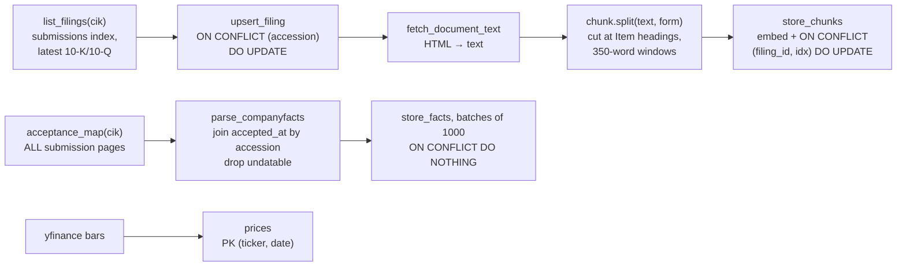

Every write is an **upsert on a natural key**, so "re-run the whole company" is always safe.
That's my recovery strategy (see "embedding fails" below).

### STAR: the duplicate facts bug

**Situation.** A first ingest failed partway through (at the prices step). I re-ran it.
Afterwards, `xbrl_facts` held **34,503** rows, but only **25,135** had been parsed. 9,368
rows had been inserted twice.

**Task.** Make re-ingest truly idempotent. This table is the ground truth for s3, so
duplicated ground truth would quietly skew verification.

**Action.** The unique key was `(accession, taxonomy, tag, unit, period_start, period_end)`.
The duplicated rows were all **instant facts**: balance-sheet items like `Assets` that
describe a single date, so `period_start` is NULL. By default, Postgres treats NULL as
*distinct from* NULL in unique constraints. Those rows never collided, and
`ON CONFLICT DO NOTHING` never fired. I changed the constraint to
`UNIQUE NULLS NOT DISTINCT (...)` (Postgres 15+). I also left a comment in `schema.sql`
saying it's load-bearing, so nobody "tidies" it away.

**Result.** I ran `make ingest` twice and got identical counts. The same key has since held
at 10× scale: **291,266 facts across 10 companies, 0 undatable**.

### The four follow-ups

**Two workers ingest the same filing at the same time.**
[Built] *Correctness* is safe. Postgres serialises conflicting inserts on a unique index: one
insert wins, and the other hits `ON CONFLICT` and updates or does nothing. No duplicates are
possible. *Efficiency* is not: both workers download and embed the same filing. There's no
job-level lock.
Two real gaps:
1. The SEC throttle is a `threading.Lock` **inside one process**. Two processes could
   together exceed SEC's 10 req/s limit.
2. `store_chunks` upserts by `(filing_id, idx)` but **never deletes**. If a re-chunk produces
   *fewer* chunks (say, after a chunker fix), the old tail chunks stay behind with stale
   section labels.

[Not built: design] A per-filing advisory lock (`pg_try_advisory_lock(hash(accession))`) to
skip duplicate work. A global rate limiter shared across workers (Redis token bucket or an
Airflow pool, Q27). And "delete chunks for this filing, then insert" inside one transaction.

**Parsing succeeds but embedding fails.**
[Built] `upsert_filing` has already committed on its own connection, so the filing row exists
with **zero chunks**. There's no job-state table. Recovery is re-running the company: every
step is idempotent, so it just redoes the work. That's acceptable because a company ingests
in under a minute.
[Not built: design] A `status` column (`fetched → chunked → embedded → ready`) so a resume
skips completed stages. That matters once embedding costs real GPU time.

**Stopping users from querying partially ingested data.**
Honestly, **today they can**. A filing with no chunks is visible to `v_filings`, and fact
batches of 1,000 commit separately. Two options:
1. Put each filing's text and chunks in **one transaction**, so they're all visible or none
   are.
2. Add a `ready BOOLEAN` column and include `AND ready` in every view and `AsOf.sql()`
   predicate. Readiness then flips only after a validation check (chunk count > 0,
   coverage row updated).

I'd pick option 2, because it also covers facts, which arrive in batches.

**Does an amendment replace the original?**
**No, and that's the design.** Two time axes are stored separately:

- **Period axis** (`period_start`, `period_end`): which stretch of time the number describes.
- **Knowledge axis** (`accepted_at`): when the world learned this version of it.

```
               value reported for FY2024 revenue
knowledge ─────────────────────────────────────────────────────▶ time
axis        t1: 10-K accepted           t2: 10-K/A (or next year's 10-K
            value = v1                  comparative column) value = v2

as_of < t1   →  no row (not public yet)
t1 ≤ as_of < t2  →  v1   (the historical view)
as_of ≥ t2   →  v2   (the current view)
```

Each version is its own row with its own accession. The lookup orders by
`period_end DESC, accepted_at DESC`, so the **newest version knowable at the horizon** comes
first. The historical view and the current view are the same query with different `as_of`
values. It's a light form of bitemporal modelling.

Caveats: `list_filings` currently only fetches `10-K`/`10-Q` *documents*, not `10-K/A`. XBRL
facts from amendments *do* arrive through `companyfacts` with their own accession. And the
corpus is only a year deep in documents, so restatement handling is less exercised than it
will be (report §9, item 5).

---

## Q7. How do you enforce point-in-time correctness?

### Reporting period vs. public availability

A filing has three dates, and only one is safe:

| date | meaning | why it's the wrong key |
|---|---|---|
| `period_end` | last day of the period the numbers describe | the numbers aren't public for weeks afterwards |
| `filed` | the filing date | a *date*: it resolves to midnight, earlier than actual acceptance, so it leaks in the unsafe direction |
| **`accepted_at`** | when EDGAR accepted and published it | **the first moment anyone could act on it** |

Apple's FY2025 10-K covers a period ending **2025-09-27** but was accepted on **2025-10-31**.
A retriever keyed on `period_end` would answer a question dated 2025-10-01 using a document
that didn't exist yet, and would *look more accurate* for it. That's why lookahead bias is
dangerous: it never produces a wrong-looking answer.

One detail from ingest: SEC's `companyfacts` API has only the `filed` date, not acceptance
time. I **joined in `acceptanceDateTime` from the submissions index by accession number**.
The submissions index is *paginated*: for Apple, 27 of 72 fact-bearing accessions sat outside
the "recent" page. Fetching only the first page would have dropped a decade of history.

### Where the cutoff is enforced: all layers, from weakest to strongest [Built]

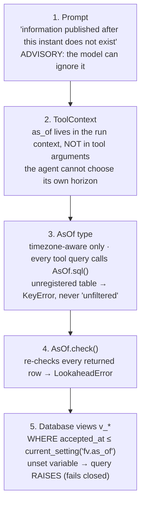

- **Layer 2 matters most in design terms.** If `as_of` were a tool argument, the agent could
  grant itself lookahead by passing a later date.
- **Layer 3 makes forgetting impossible.** `AsOf` can't be built from a naive datetime,
  because a naive one silently assumes local time and shifts the horizon by hours. A table
  without a registered point-in-time column raises instead of defaulting to unfiltered.
- **Layer 5 exists because of a hole I found while building the SQL tool.** The first version
  let the agent query `xbrl_facts` directly. The agent *writes the SQL*, so nothing stopped
  `SELECT * FROM xbrl_facts`. A Python-side filter is only advisory when the attacker (for
  this purpose, the model) controls the query. So enforcement moved into the database. At
  horizon 2020-01-01, the newest fact visible through the views is from 2019-10-30.
- **Prices** have no acceptance time. A daily bar is knowable at that day's close. `adj_close`
  is **excluded from `v_prices`**, because later splits and dividends rewrite it after the
  fact.

### Measured result: A1 lookahead leak rate [Measured]

24 horizons swept across the corpus. Leakage is always judged against acceptance time,
however each strategy filtered.

| filter | filings leaked | pooled rate | horizons affected |
|---|---|---|---|
| no filter | 48/96 | 50.00% | 21/24 |
| `period_end` (the "careful" choice) | 10/58 | **17.24%** | 10/24 |
| `accepted_at` (FinanceVault) | 0/48 | **0.00%** | 0/24 |

The worst case under `period_end`: a 10-Q for the period ending 2025-12-27 was visible at an
as-of of 2025-12-27, **34 days before it was accepted** (2026-01-30). Caveat: the filings side
is only 4 documents for one company. The facts side (590k row-checks) is better powered and
also 0.00%.

### Could a cache or secondary tool introduce newer information?

- **The journal:** no. Its key includes the full message list, and the first message states
  the as-of. Two runs at different horizons can never share a cached response.
- **The embedder and reranker:** static models, with no data from the corpus in their weights.
- **The model's own memory:** **yes, and it's the biggest real leak.** B0 (no tools) scored
  10%. Every one of those right answers came from training data, and B0 can't respect a
  horizon at all. s3's `uncited` label exists to catch "right from memory" answers inside
  the agent (Q16).
- **A small metadata leak I found while writing this.** `coverage.advice()` tells the agent
  that "the document corpus covers 2025-08-04 to 2026-08-03", and the corpus bounds are
  computed over *all* filings, not as-of filtered. At a 2010 horizon, that reveals future
  filings *exist* and when they were accepted. It reveals no values, but strictly it's
  information from after the horizon. The fix is to phrase it without future dates ("no
  filing documents are available at this date").
- **The SQL allowlist can be bypassed.** That's a real hole in layer 5's *preconditions*,
  covered in Q31.

### Testing a later amendment against an earlier as-of query [Built]

`tests/test_asof.py` has `test_lookup_excludes_a_fact_published_one_second_later` and
`test_period_end_is_not_a_safe_horizon`. `tests/test_tools.py` has
`test_sql_cannot_see_past_the_horizon`. The amendment test I'd add, the full two-version
case:

1. Insert fact A: `(AAPL, Revenues, FY2024)`, value v1, accepted t1.
2. Insert fact B: the same tag and period, **a different accession**, value v2, accepted
   t2 > t1.
3. Assert: as_of = t1 − 1s → no rows. as_of = t1 → v1 first. as_of = t2 − 1s → still v1.
   as_of = t2 → v2 first, with v1 still present below it.
4. Run the same assertions through `lookup_fact`, `sql` (via `v_xbrl_facts`) and s3's
   `_exists_on_record`, so every read path is covered.

---

## Q8. Why combine dense retrieval and BM25?

**A precision point first:** the lexical half isn't textbook BM25. It's **Postgres
full-text search**: `to_tsvector('english')`, `plainto_tsquery`, ranked by `ts_rank`.
`ts_rank` weights term frequency and doesn't use corpus-wide inverse document frequency or
BM25's saturation curve. For this purpose it plays the same role (exact-term matching), but
I'd say "lexical full-text search" in an interview, not "BM25". Real BM25 would need an
extension such as `pg_search`, or an external engine.

### What's built [Built]

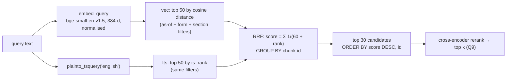

### When each side wins

| query | winner | why |
|---|---|---|
| "Item 1C cybersecurity", "RevenueFromContractWithCustomerExcludingAssessedTax", "112,010" | **Lexical** | exact identifiers, tag names, section codes and specific figures. An embedding blurs "Item 1C" into "some security discussion", and numbers embed poorly. |
| "what is management worried about in its supply chain?" | **Dense** | The filing says "we depend on single-source suppliers for certain components". There's little word overlap, but the meaning is close. |

### Why reciprocal rank fusion instead of adding scores

Cosine distance and `ts_rank` are on **incomparable scales**. One is bounded and
geometric; the other is unbounded and depends on document length. Adding them means picking
a weight, and I had no retrieval-quality measurement to tune a weight against. That would
have been guesswork presented as engineering. RRF uses only *ranks*, has one standard
constant (k = 60), and is robust without tuning. The SQL comment says exactly this.

### When both methods return the same chunk

`UNION ALL` then `GROUP BY id, sum(score)`. A chunk found by both gets **both** contributions,
so agreement between the two methods boosts it. That's usually what you want. Ties are common
with RRF (two chunks at the same rank pair produce the same score), so the final
`ORDER BY fused.score DESC, c.id` has an explicit tie-break. It was missing once, and it broke
replay (Q24).

### Measuring retrieval quality separately from answer quality

**Honestly: not measured yet.** The benchmark's 152 questions are all numeric, with ground
truth from XBRL, so no question has "the relevant chunk ids" labelled. The only proxies:

- **s4 retrieval relevance**, which is LLM-judged per step. It isn't calibrated against human
  labels yet (Q17).
- **One spot check** of the reranker (Q9).
- **B1 RAG at 6.7% accuracy.** That says passages are the wrong evidence for these
  questions, not that retrieval is bad.

[Not built: design]
1. Add ~50 narrative questions with **labelled relevant chunk ids** (two annotators).
2. Measure the **candidate stage** with recall@30 (did the right chunk reach the shortlist?)
   and the **ranked output** with nDCG@5 and MRR, separately.
3. Ablate dense-only, lexical-only, RRF, and RRF + rerank on the same labels.
4. Only then connect retrieval metrics to answer accuracy on P1/P4 questions. Otherwise an
   answer-level change can't be blamed on retrieval or on generation.

---

## Q9. What does the cross-encoder add?

### What it is [Built]

`cross-encoder/ms-marco-MiniLM-L-6-v2` reranks the 30 fused candidates from Q8 and trims
them to `k` (default 5, max 20).

A **bi-encoder** (the embedder) turns the query and each passage into vectors
*separately*, then compares the vectors. It never sees them together, so it can't tell
"net income was $112,010 million" from "the Company designs and markets smartphones"
beyond both being "about Apple". A **cross-encoder** reads the *pair* in one forward pass
and scores how well this passage answers this query. On a spot check it scored the relevant
passage **+7.0** and two irrelevant ones **−11.3**.

### Why it's more expensive

- Bi-encoder passage vectors are **precomputed at ingest**. At query time you embed one
  query, and the index does the rest.
- A cross-encoder score **can't be precomputed**: it depends on the query. So it costs *one
  transformer forward pass per candidate per query*. Here that's 30 pairs of up to 512
  tokens each (a 350-word chunk is roughly 450–500 tokens), on CPU, inside the request.

That's why it runs as a **second stage over a shortlist**, never over the corpus.

### Why 30 candidates

**Chosen, not tuned.** The rule is "clearly wider than `k`, because a reranker can only
promote a passage that reached the shortlist". I haven't swept it. The right way to choose
it: plot candidate-stage recall@N against N, plus reranker latency against N, and pick the
knee (Q8's labelled set is the prerequisite).

Two design choices I would defend:

1. **A relative drop threshold, not an absolute one.** Cross-encoder scores are unbounded
   logits. They're comparable *within* one query's candidates and meaningless *across*
   queries. So a candidate is dropped when it scores more than 8.0 below the best one. A
   fixed floor would keep everything on an easy query and drop everything on a hard one.
2. **Fewer good passages beat padding to k, but never return nothing.** Every extra passage
   costs input tokens on every later step, because the conversation is re-sent each step.
   An empty result tells the agent less than a weak one, so the best candidate always
   survives.

### If the right evidence isn't in the 30

Then the reranker **can't fix it**. It only reorders. That's a *recall* failure in the
first stage, and it shows up as the agent re-querying (lower s4, more steps). The
mitigations are upstream: a wider shortlist, better chunking, or letting the agent filter by
section (built: a bad section name returns the list of valid ones).

### Accuracy gain and p95 cost

**Not measured, and I'd say so directly.** I have no with/without-reranking ablation and no
p95 latency for it. Two reasons:

- A reranking ablation changes tool observations, which changes every downstream prompt and
  journal key (Q24). So it needs a **fresh live sweep**, not a free replay.
- E2 latency is unreported for structural reasons (Q29).

What exists is correctness testing, not benefit measurement. `tests/test_rerank.py` has 14
tests, including `test_reranking_actually_reorders`, which guards against the failure that
looks like success: returning input order with scores attached.

[Not built: design] Run the dev split's P1/P4 questions with `rerank=off` vs. `rerank=on`,
cold journal, same model. Report accuracy per archetype with a paired test on the same
questions (McNemar), plus the p50/p95 of the `retrieve_filings` span. Keep reranking only if
the accuracy gain survives and the p95 increase fits the latency budget.

---

## Q10. What are the five execution paths?

### The paths [Built]

| path | meaning | tools | step cap |
|---|---|---|---|
| **P0** | general knowledge ("what does EBITDA stand for") | `finish` | 2 |
| **P1** | narrative from a filing (risks, MD&A) | `retrieve_filings`, `finish` | 4 |
| **P2** | one reported figure | `lookup_fact`, `finish` | 4 |
| **P3** | aggregation, comparison across periods, derived calculation | `sql`, `python`, `finish` | **10** (was 6) |
| **P4** | several of the above, or unclear | all five | **12** (was 8) |

`finish` is on every path, so a run can always stop. The effective cap is
`min(caller's max_steps, path cap)`.

**Why each path exists:** restricting tools **keeps cheap questions cheap** (P2 sends 2 tool
schemas instead of 5, and has a 4-step ceiling). It also makes routing a **scorable
decision**: sending a filing question to P0 is a specific, visible failure. They overlap on
purpose. P4 is a superset of everything, and it's the fallback.

### Why an LLM router instead of rules

The questions are free text. A keyword rule ("contains 'change' → P3") breaks on "how did
the risk language *change*" (that's narrative, P1). One Haiku call with a fixed rubric costs
fractions of a cent. The rubric tells it: *"When torn between two paths, choose the more
capable one. A path that is too narrow strands the question; a path that is too wide only
costs tokens."* That's the cost-asymmetry argument written into the prompt. If the reply
can't be parsed, it **falls back to P4** and records the reason, so the fallback shows up in
metrics instead of looking like a normal P4.

It is **deliberately not learned yet**. MVP1's job was to measure how good a fixed rubric is
before improving on it.

### Misroutes

| misroute | consequence |
|---|---|
| simple question → P4 | more tokens (5 tool schemas, higher step cap). Still answers. Cheap failure. |
| delta question → P2 | **stranded**: no `python`, so the model either computes in its head (the prompt forbids it, and s3 may flag it) or runs out of steps |
| multi-hop question → P3 | what actually happens. See the measured problem below. |

### What I measured: the router's real behaviour [Measured]

On the dev split, the router **never picked P4**. It sent *every* multi-step archetype
(delta, ratio, cross-company) to P3, whose cap was sized for "one SQL aggregate". Half of P3
runs were hitting that cap, and aborted runs are scored as wrong. That fed directly into the
"three nested ceilings" confound (Q12). The router's behaviour and the budget design
interacted to *understate* the stronger model by 13 points. P3 went to 10 and P4 to 12.
Report §9 lists "the router never selects P4" as an open threat: I haven't tested whether
that's correct routing or under-classification.

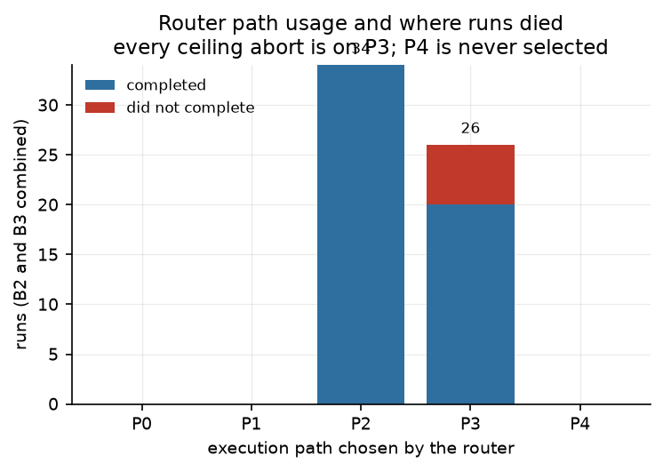

An earlier claim I **retracted**: MVP1's report argued that "restricting tools matters more
than the router", because the all-tools variant scored 0% accept / 30% correct. That was
caused by a prompt bug (the model *wrote* `<finish>` as text instead of calling the tool,
Q12), not by routing. After the fix the same variant scored 50% / 80%, and the claim was
withdrawn in writing.

### How to evaluate routing when several paths could work

Exact-label accuracy is the wrong metric, because "the correct path" is often a *set*. What
I'd measure (the rollout variants are most of the way there: `facts_only` = P2,
`text_only` = P1, `compute` = P3, `full` = P4):

1. **Force every path** on each question. The admissible set is the paths that produce a
   correct answer.
2. **Strand rate** = routed to a path outside the admissible set. This is the expensive error.
3. **Routing regret** = cost of the chosen path minus cost of the cheapest admissible path.
   This is the cheap error.
4. Report both per archetype. A router with 0% strand rate and modest regret is doing its
   job, even with poor exact-label agreement.

---

## Q11. What are the five typed tool interfaces?

### One declaration, three consumers [Built]

Each tool is a **Pydantic input model plus a handler**, registered once in
`tools/registry.py`. That single definition generates:

1. the JSON schema sent to the model (`Tool.spec()`),
2. validation at dispatch (`Registry.validate`),
3. the **s1 tool-validity signal** (Q16).

Because the verifier and the runtime use the same schema, s1 measures *the agent*, not
agreement between two hand-written schemas that drifted apart.

| tool | input (key fields) | output | notes |
|---|---|---|---|
| `retrieve_filings` | `query`, `k` (1–20), `form?`, `section?` | passages with `chunk_id`, `section`, `accession`, `accepted_at`, `rerank_score` | hybrid + rerank (Q8, Q9) |
| `lookup_fact` | `tag`, `period_end?`, `unit`="USD", `fp?` | up to 20 fact rows | as-of filtered, newest version first |
| `sql` | `query` (one read-only SELECT) | `{rows, row_count, truncated}` | views only, 5 s timeout, 200 rows (Q31) |
| `python` | `code` (arithmetic, sets `result`) | `{result, stdout}` | subprocess, no imports (Q31) |
| `finish` | `answer`, `citations[]`, `value?`, `unit?` | echoes them back | **terminal**. Structured citations are what make s2 and D2 computable at all. |

**`lookup_fact`, exactly:**

```python
class LookupInput(BaseModel):
    tag: str                          # "NetIncomeLoss", "Revenues", ...
    period_end: date | None = None    # omit for latest
    unit: str = "USD"                 # "USD", "shares", "USD/shares"
    fp: str | None = None             # "FY", "Q1", "Q2", "Q3"
```

```json
{"ok": true, "error": null, "data": [
  {"tag": "NetIncomeLoss", "value": 112010000000.0, "unit": "USD", "fy": 2025, "fp": "FY",
   "period_start": "2024-09-29", "period_end": "2025-09-27", "form": "10-K",
   "accession": "0000320193-25-…", "accepted_at": "2025-10-31T…"}
]}
```

Every tool returns the same envelope: `ToolResult(ok, data, error)`.

### Syntax checks vs. meaning checks

| layer | checks | where |
|---|---|---|
| **Syntax** | types, required fields, `k` in 1–20, date parsing | Pydantic, at dispatch, *before* execution |
| **Statement shape** | SQL: one statement, starts with SELECT/WITH, no write keywords, only allowed views. Python: parses, no imports, no dunder access, no `eval`/`open`. | static checks inside the handler |
| **Meaning** | Does the tag exist for this company at this horizon? Does the section exist? Are there any documents at this horizon? | the handler, against the database |
| **Meaning, after the fact** | Do citations point at things actually retrieved? Do figures trace to evidence? | the verifier (s2, s3). *Not* enforced at call time (Q16). |

Meaning-level errors are written to be **actionable by the model**. A wrong tag returns the
five closest real tags by trigram similarity (`NetIncome` → `NetIncomeLoss`). A wrong
section returns the valid list. An empty horizon says "stop searching documents, use XBRL".
The system prompt tells the agent "errors often name the correct tag or table".

### "No data" vs. invalid arguments vs. dependency failure

**Honest gap:** today all three become `ok=False` with a **string** `error`. The difference
is only in the wording:

| case | today's error text |
|---|---|
| invalid args | `k: Input should be less than or equal to 20` |
| no data | `no fact for tag='X' unit='USD' knowable at … Try a different tag; similar …` |
| empty horizon | `No filing documents are visible at this as-of date…` |
| dependency failure | `OperationalError: …` (the handler exception is caught and returned as an observation, not a crash) |
| timeout | `query exceeded 5000ms` / `execution exceeded 5s` |

That's fine for the model, which reads prose. It isn't fine for **metrics or retry logic**.
Nothing can tell "the database is down" (retry) from "that tag doesn't exist" (don't retry)
without parsing strings.

[Not built: design] Add `kind: Literal["invalid_args", "not_found", "empty_at_horizon", "dependency_unavailable", "timeout"]`
and `retryable: bool` to `ToolResult`. Keep the prose for the model. The executor retries
`dependency_unavailable` with backoff (Q15). The metrics report error kinds per tool.

### Changing a schema while an old client still calls it

Who counts as a "client" here is unusual. The **model** reads the current spec on every call,
so it can't be out of date. The real old clients are **stored trajectories and training
data**.

- **Journal:** safe. Tool specs are part of the hash, so a schema change makes every old key
  miss (loud), never silently return a response produced under the old schema.
- **Stored steps:** a hazard. Re-verification runs s1 against the *current* schema, so a
  renamed field would make old, valid steps fail s1 retroactively. That would silently
  change which trajectories count as "accepted" training data.

[Not built: design] Additive changes only (new optional fields with defaults). Breaking
changes get a new tool name (`lookup_fact_v2`), with the old one kept registered. Store
`tool_schema_version` on each `steps` row, and validate against the version the step was
produced under.

---

## Q12. What prevents agent loops and excessive spending?

### Every limit, not just max steps [Built]

| limit | value | enforced where |
|---|---|---|
| steps per run | `min(12, path cap)`: 2/4/4/10/12 | `Ledger.step()` before each model call |
| **dollars per run** | $0.25, **measured in list cost** | `Ledger.check()` before a live call and after every charge |
| wall clock per run | 300 s | `Ledger.check()` |
| tokens per model call | 4,096 (thinking and output together); router 16; judge 120 | request parameter |
| SQL | 5 s `statement_timeout`, 200 rows | inside the transaction |
| Python | 5 s timeout, 256 MB address space, 5 s CPU, 16 file descriptors, 0-byte file writes | subprocess + rlimits (best effort on macOS) |
| observation size | 6,000 characters into the next prompt | `_observation_text` |
| corrective nudges | **1** per run | executor |
| verification | its own ledger ($0.05 per run), never charged to the policy | harness |

Every run ends with a **recorded reason**: `ok`, `max_steps`, `budget_exceeded`, or
`no_tool_call`. A policy that keeps running out of budget shows up as a count, not as a vague
drop in accuracy.

### STAR: three nested ceilings, and only one was real [Measured]

**Situation.** B2 and B3 were aborting on 27% and 20% of dev runs. An earlier sweep had B2 at
66.7% and B3 at 70.0%. That reads as "the cheap model nearly matches the frontier model at a
fraction of the cost", which would have been a great headline.

**Task.** Before believing a flattering result, check whether the budget limits were
measuring the models or measuring themselves.

**Action.** I found three defects stacked on top of each other, each hiding the next:

1. **The config default did nothing.** I raised `max_steps` in `config.py` and nothing
   changed, because `.env` sets `FV_MAX_STEPS` and the environment wins. A setting with an
   override has *two* places to change it, and editing the wrong one is a silent no-op.
2. **The global ceiling wasn't the binding one.** The executor does
   `ledger.max_steps = min(ledger.max_steps, route.max_steps)`. Every aborted run was on P3,
   whose own cap was 6, and `min(12, 6)` is still 6. I raised P3 to 10 and P4 to 12.
3. **The dollar ceiling was checked against *actual* spend, so a replayed run had no
   ceiling.** Journal hits cost $0, so a warm run sailed past the point where its cold twin
   had aborted. The same question produced **different trajectories depending only on cache
   state**. It surfaced as B3 gaining 3 accuracy points between two *identical* sweeps. The
   ledger now enforces on `list_usd`, because "this run may spend five cents" has to mean
   the same thing warm or cold. The regression test is
   `test_a_run_aborts_at_the_same_point_cold_or_warm`. The old test had *encoded the bug*: it
   set a ceiling below a call's price to prove the response came from cache.

**Result.** With the ceilings genuinely lifted, the gap between the models widened from
**3 points to 14** (B2 73%, B3 87% at that stage). B3 aborts fell from 7/30 to 2/30. The
"cheap model matches frontier" story **didn't survive**. The ceilings hit hardest on the
policy that made best use of steps, so the confound had pushed the result in the flattering
direction. I made the method lesson the headline of report §7.3.

### Detecting repeated calls with no progress

**Not built.** The one-nudge rule stops "wrote the tool call as text" loops, and the step cap
stops everything else, but nothing notices "same call, same result, again".

[Not built: design]
- Hash `(tool, canonical(args))` per run. On a repeat, don't execute. Return an
  observation: "You already ran this exact call at step N; the result was identical."
- A **progress signal**: the number of new evidence values from `numeric.collect_evidence`
  (Q16). No new evidence in 3 steps → inject a "commit or finish" instruction. Still none →
  end the run as `no_progress`, a distinct outcome.

### When the budget runs out halfway

Today the run ends immediately with `max_steps` or `budget_exceeded`. It's persisted and
**scored as a failure**. Partial work (facts it did retrieve) isn't turned into an answer.
Two details:
- The dollar check can **overshoot by up to one call**. The ledger checks *before* a live
  call, but it can't know that call's cost until afterwards. At most that's one response of
  4,096 output tokens: about $0.06 on Sonnet 5 at list price.
- The paid-for response is **journalled before the ledger raises**. So re-running with a
  bigger budget replays the paid prefix for free and pays only for the continuation. That's
  why the whole §7.3 investigation cost **$0.41 instead of about $8**.

[Not built: design] Keep the last step in reserve: when `steps == cap − 1`, offer *only*
`finish`, with an instruction to answer from the evidence gathered or say it can't. That turns
"no answer" into "best answer or explicit abstention".

### Can a valid-looking result drive the agent to chase an impossible task?

**Yes. This is the second STAR, and it was the root cause underneath the ceilings.**

**Situation.** s4 (retrieval relevance) averaged **0.16 on `sql` steps**, against 0.80–1.00 on
everything else. That was odd enough to investigate.

**Task.** Find out whether the agent was retrieving badly or something else was going on.

**Action.** The judge wasn't wrong: it was correctly scoring "retrieval returned no rows"
over and over. XBRL facts go back to **2009** (companyfacts carries a company's full
history), but filing *documents* were only ingested for the last year (**2025-08 onward**).
**9 of the 30 dev questions** had horizons where *no documents existed at all*. That's
correct point-in-time behaviour (in 2010 nobody could read a 2025 10-K). But an empty result
looks exactly like a bad query, so the agent rephrased and retried into a table that would
never have rows.

| | runs | aborted | mean steps |
|---|---|---|---|
| B2, no documents at horizon | 9 | **5** | 6.7 |
| B2, documents present | 21 | 2 | 3.5 |
| B3, no documents at horizon | 9 | **2** | 6.0 |
| B3, documents present | 21 | 0 | 3.0 |

Fix (`env/coverage.py`): **the environment now states its own coverage.** `retrieve_filings`
returns an explanatory error instead of an empty list. The executor adds one line to the first
message when the horizon predates the documents, naming the window and redirecting to XBRL.
Saying it *up front* matters more than the tool error, because the agent needs to know
*before* it spends the step.

**Result.**

| | before | after |
|---|---|---|
| B2 accuracy | 73.3% | **76.7%** |
| B3 accuracy | 86.7% | **93.3%** |
| B3 aborted runs | 2/30 | **0/30** |
| B3 delta-question accuracy | 57.1% | **85.7%** |

The "agents are bad at delta questions" finding was mostly this. Delta questions reach
further back in time, so they landed disproportionately on empty horizons. It was the
**third time in one stage that an apparent capability finding was an environment defect**,
and all three made the system look *worse*. That's the direction nobody questions.

---

## Q13. How do you retry a write that timed out?

**Framing:** this system has four kinds of writes, and they sit at different points on the
idempotency spectrum. I'd walk through what's built, then what's missing.

### Where the idempotency keys are [Built]

| write | idempotency key | behaviour on retry |
|---|---|---|
| filing upsert | `accession` | `ON CONFLICT DO UPDATE`, safe |
| fact insert | `(accession, taxonomy, tag, unit, period_start, period_end)` | `ON CONFLICT DO NOTHING`, safe (after the NULLS fix, Q6) |
| chunk upsert | `(filing_id, idx)` | `DO UPDATE`, safe apart from the stale-tail gap (Q6) |
| **journal put** | `hash` = SHA-256 of the canonical request | `ON CONFLICT DO NOTHING`: **first write wins** |
| run insert | `runs.id`, a UUID **generated in the client** | plain `INSERT`. A retry of a committed write fails with a unique violation. |
| verifier scores | `(run_id, idx)` | `UPDATE`: recomputable, so a repeat is harmless |

### Telling "failed" from "committed but the response was lost"

The general answer is to **make the key client-generated, then read your own write**. Because
`run.id` is a UUID created *before* the insert, after a timeout I can
`SELECT 1 FROM runs WHERE id = %s`. Present means it committed, so don't retry. Absent means
retry. The journal works the same way: its key is derived from content, so a retry either
inserts or does nothing, and the outcome is the same either way.

### Two concurrent retries

- **Journal:** the primary key serialises them. One inserts, the other gets
  `DO NOTHING`. `DO NOTHING` was chosen over `DO UPDATE` on purpose: if the same request ever
  produced two *different* responses, the first one is kept rather than overwritten. The
  comment in the code calls this "a determinism failure worth detecting later". To be
  honest, nothing compares the losing response to the stored one today, so the difference is
  silently discarded. Detecting it would mean hashing the response and logging when it
  doesn't match.
- **Runs:** the second insert raises a unique violation, which is the correct signal
  ("already done").

### The gaps I'd own

1. **`runs` and `steps` aren't written atomically.** `executor.save` inserts the run, then the
   steps, on separate pooled connections. A crash in between leaves a run with no steps. The
   verifier returns `[]` for it, and the harness then scores it as unanswered, which is
   technically true but for the wrong reason. **Fix:** one transaction for both.
2. **The model call itself isn't idempotent.** The journal is written *after* the response
   arrives. If the client times out mid-call, or the SDK retries internally (the Anthropic SDK
   retries twice by default), you can be **billed twice** for one logical call, and the
   journal doesn't prevent it. It only deduplicates *completed* calls.
3. **The run is saved only at the end.** A crash mid-run loses the trajectory. The journal
   still has every completed model call, though, so re-executing replays them at $0 up to the
   crash point. The only loss is wall time.

### A write spanning the database and an external service

For example: *record the model call* and *pay for the model call*. There's no distributed
transaction across Postgres and an HTTP API, so:

[Not built: design] the **intent record, or outbox, pattern**:

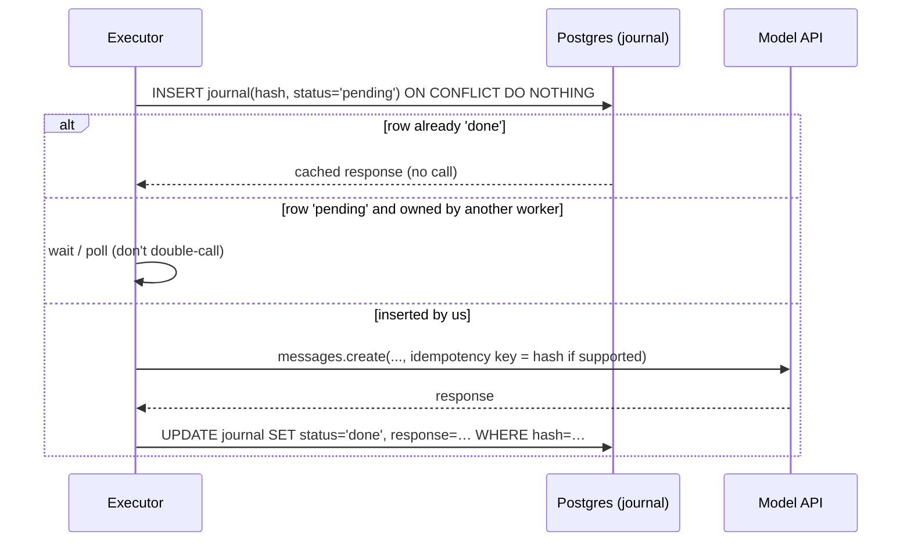

A crashed `pending` row gets a lease timeout, after which another worker may retry. That
retry is an accepted, bounded double-charge rather than an unbounded one.

---

## Q14. How do you handle concurrency and backpressure?

**Honest framing:** today there's **no request concurrency**. The harness runs questions one
at a time, and there's no API service. So this answer has two parts: the resource limits
that exist, and how I'd do admission control, based on what I know about the workload.

### Limits that exist today [Built]

| resource | limit | what happens at the limit |
|---|---|---|
| Postgres pool | `max_size=8` (psycopg_pool) | callers wait up to the pool timeout (30 s default), then get `PoolTimeout` |
| **SQL tool connections** | **none**: it opens a *new direct connection per call* (needed for a read-only transaction with its own session setting) | at concurrency, this exhausts Postgres `max_connections` (default 100). It's the first thing I'd fix (Q30). |
| sandbox processes | one subprocess per `python` call, 5 s each | no cap on concurrent children |
| SEC | 5 req/s through a `threading.Lock` | per process only (Q6) |
| model API | none of my own; the provider rate-limits | 429s would surface as exceptions |

### What the workload looks like (from measured data)

- A run is **3–4 model calls on average** (mean steps 4.33 for B2, 3.37 for B3), and each
  call takes **seconds** (MVP1's live B2 p95 was 12.3 s per run; in the one sweep where B3 ran live,
  its p50 was 8.4 s and p95 17.3 s).
- Cost and duration are **very uneven by path**: P0/P2 finish in 1–2 steps, P3/P4 use up to
  10–12.
- The run's **maximum cost is known up front** (`max_usd`), and the path is known after the
  first, cheap router call.

### The design [Not built: design]

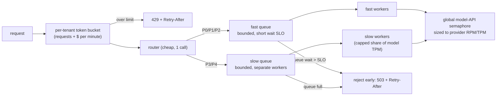

- **Where requests wait:** in *bounded* queues in front of workers, never in an unbounded
  in-memory list or a hung DB pool. A request whose expected wait already exceeds its
  deadline is rejected **at admission**, not after it has spent money.
- **When to reject:** queue depth × observed service time > deadline. Or the tenant's
  dollar bucket is empty. The budget ledger already gives the worst-case cost per run, so
  admission can *reserve* `max_usd` and release the unused part at the end.
- **Stopping expensive requests starving cheap ones:** **separate queues and worker pools by
  path**, with P3/P4 capped at a fixed share of model-API capacity. It's the same idea as
  separating the SQL tool's connections from the system's own pool: a heavy class can
  saturate its own lane but not the shared one.
- **DB:** one pooled, read-only, least-privilege role for agent SQL (Q31), sized
  separately from the system pool. PgBouncer in transaction mode if replicas multiply.

---

## Q15. What happens when SEC or model serving is unavailable?

### What still works

| dependency down | what still works | what fails |
|---|---|---|
| **SEC EDGAR** | **Every question.** Serving reads only Postgres. SEC is touched only by ingest. | new filings aren't ingested (data goes stale, and the coverage window says so, Q12) |
| **Model API** | **Replay of any journalled run** (`FV_REPLAY=true`), all metric recomputation, re-verification of the programmatic signals (s1, s3, s5) | every live question. Even P0 needs one call. Judged signals degrade to a neutral 0.5. |

### STAR: the API became unavailable mid-sweep [Measured]

**Situation.** During the first four-policy dev sweep, after B0, B1 and B2 had finished (30
questions each) and B3 had done 3 of 30, every call started failing with
`400 invalid_request_error: Your credit balance is too low`.

**Task.** Don't lose the paid work, and don't pay for it twice.

**Action.** Nothing special was needed, because the design already handled it. Every
completed call was in the journal and every completed run was in Postgres. Once credit was
restored, I re-ran the same command.

**Result.** B0–B2 and B3's first three questions **resolved from cache at $0**. Only the
remaining 27 B3 runs cost money. Cumulative spend at that point was **$2.02 across 756 journal
entries**. The exhaustion was the account balance, not the project overspending.

That same sweep then exposed a second bug: replay hit `ReplayMiss` at `step-4` because of
unordered SQL (Q24). Outages are good at surfacing determinism bugs.

### Which failures to retry

| class | examples | policy |
|---|---|---|
| **Transient: retry with backoff** | 429 rate limit, 529 overloaded, 5xx, connection reset, timeout | exponential backoff with **full jitter**, max 3–4 attempts, respect `Retry-After` |
| **Permanent: fail immediately** | 400 bad request (e.g. the `temperature` rejection: current models reject sampling parameters outright), 401/403, credit exhausted, schema validation, `ReplayMiss` | retrying can't fix them and only burns quota |
| **Semantic, not transport** | a tool returning "no such tag" | not a retry. It goes back to the *agent* as an observation. |

**Today:** SEC calls `raise_for_status()` with **no retry**. `tenacity` is a declared
dependency that **nothing uses**. Model calls get only the SDK's default retries. `ReplayMiss`
is deliberately fatal: falling back to a live call would make a "free" replay cost money and
report determinism on freshly generated output.

### Not overwhelming a recovering dependency

[Not built: design]
- **Jitter**, so retries don't synchronise into waves.
- **A retry budget:** retries may add at most about 10% to baseline traffic. Past that, fail
  fast.
- **A circuit breaker per dependency:** open after N consecutive failures, half-open with a
  single probe, close on success. While open, *reject at admission* (Q14) instead of queueing
  work that will fail.
- **SEC specifically:** keep the 5 req/s throttle global across workers (Q6), well under the
  published 10 req/s.

### What the user gets when only part can be done

[Not built: design] A structured partial result rather than a 500:
`{"status": "partial", "answer": null, "evidence": [facts retrieved so far, with accessions], "reason": "model service unavailable after 3 attempts", "retry_after": 30}`.
The rule I'd hold to: **never return a computed figure the pipeline didn't finish verifying.**
Returning retrieved facts with citations is safe. Returning a half-derived number isn't.

---

## Q16. What is step-level verification?

### What counts as a step [Built]

**One tool call** = one row in `steps`. Two edge cases are handled explicitly:
- If one model response contains two `tool_use` blocks, each is its own step (they share the
  response's token counts).
- A response with **no tool call** is also recorded as a step, with `tool = NULL`, so "the
  model answered in prose instead of acting" is scorable (s1 = 0).

### The five signals

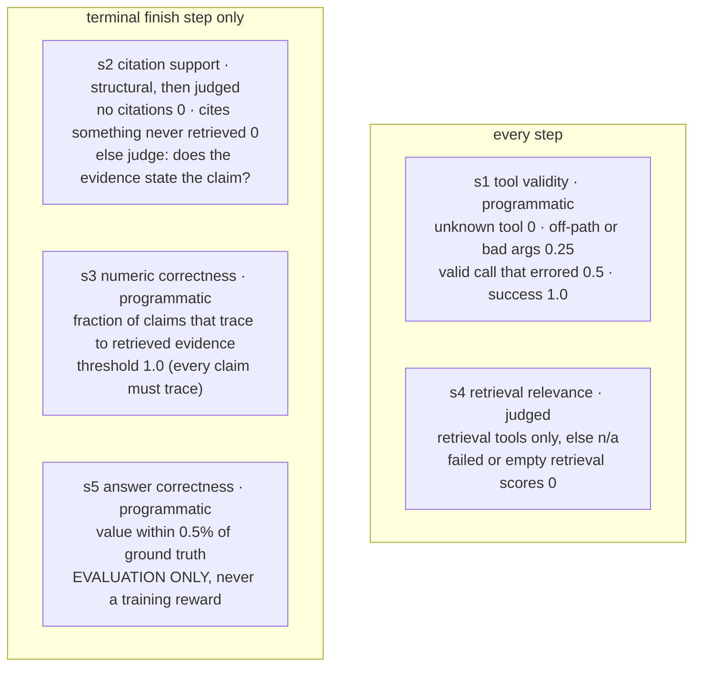

| design rule | why |
|---|---|
| **The signals that decide correctness are programmatic** (s1, s3, s5) | a judge asked "is this plausible?" says yes, and plausible is the failure mode (Q2) |
| **s3 threshold 1.0, others 0.5** | "every figure traces" is an AND, not an average (Q2) |
| **Inapplicable signals score 1.0 with `applicable=False`** | a retrieval step shouldn't lose points on numeric correctness. But see the STAR below. |
| **s5 is excluded from the training reward** | otherwise the "process" filter becomes a proxy for the "outcome" filter, and H1 would answer its own question (Q18) |

**STAR: an inapplicable signal counted as a correct answer.**
*Situation:* B2's first MVP1 accuracy read **100%**. *Task:* a perfect score from the cheap
model is a bug until proven otherwise. *Action:* a run that never calls `finish` has no
terminal step, so s5 there is "n/a" and scores 1.0. The harness read the *last verdict's
score*, so "no answer" counted as "right answer". I added the `applicable` flag, introduced
`Signal.verified` (applicable *and* passed), and routed every correctness question through
**one function**, `answered_correctly()`: a `finish` step must exist, s5 must have applied,
and it must have passed. There are regression tests. *Result:* the true figure was **85%**,
and it was corrected in the published table.

### Schema-valid but financially wrong (s1 = 1.0, still wrong)

1. `lookup_fact(tag="NetIncomeLoss", period_end="2018-09-29")` **without `fp`**. Apple's FY2018
   and Q4-2018 share that end date, so both rows come back, and the agent quotes the quarter
   as the year. (This exact collision broke my benchmark generator, Q20.)
2. `sql("SELECT sum(value) FROM v_xbrl_facts WHERE tag='Revenues' AND fy=2025")`. 10-Q
   duration facts include **year-to-date** rows (3-, 6- and 9-month), so summing by fiscal
   year double-counts. Valid SQL, confident, wrong.
3. `finish(answer="$112.01 million", value=112010000, unit="USD")`: the right digits, 1000×
   too small. s1 = 1.0, s3 = 0 ("off by 1000×").

### Before execution, after execution, or both?

- **Before execution (online, in the executor):** schema validation and the SQL/Python static
  checks. An invalid call is **not executed**. The model gets the validation error as an
  observation, and the step is still recorded, so s1 can score it.
- **After execution (offline, `verify_run`):** all five signals, on the stored trajectory.
  This is the main verifier.

**Honest limit:** the verifier is used for **evaluation and for filtering training data**. It
does **not** gate live answers. A user-facing run today could return a scale error that s3
would have caught.

### What happens after a failed check

| context | today | design |
|---|---|---|
| training data | failing trajectories are **filtered**: accepted / repaired by cutting the step / hard negative (Q18) | same |
| live answers | nothing | [Not built: design] Run s3 **at `finish` time** (it's cheap and programmatic). If it's below 1.0, return one correction turn with the *reason* ("'$112.01 million' is off by 1000× against NetIncomeLoss = 112,010,000,000"). If it fails again, **abstain** with the retrieved evidence. One correction turn, like the one nudge, so a stubborn model can't loop. |

Other fixes that make s3 usable on real answers are in Q2 (dates, parentheses).

---

## Q17. How do you label steps and evaluate the verifier?

### Where ground truth comes from

| signal | ground truth | status |
|---|---|---|
| s5 | expected values generated from XBRL facts | **[Built]**, but circular (see below) |
| s1, s2, s3 | **seeded errors**: take runs the verifier passed, inject a known defect | **[Measured]** (below) |
| s2, s4 (judged) | **human labels**, Cohen's κ per signal | **not measured.** It's the main gap and the gate for H1. |

**Seeded-error calibration** (`bench/verifier_calib.py`, `eval/results/b2_seeded.json`). Since
I construct the defect, there's no ambiguity about whether the step is wrong. That's
stronger than human agreement for these classes.

| error class | signal | seeded | caught | recall |
|---|---|---|---|---|
| off_by_1000 | s3 | 20 | 20 | 100% |
| wrong_scale_word | s3 | 19 | 19 | 100% |
| wrong_period | s3 | 20 | 20 | 100% |
| fabricated_value | s3 | 20 | 20 | 100% |
| fabricated_citation | s2 | 20 | 19 | 95% |
| hallucinated_tool | s1 | 20 | 20 | 100% |
| malformed_args | s1 | 15 | 15 | 100% |
| **control (unmodified)** | all | 20 | **0 flagged** | **0% false positives** |

Two methodological choices matter here. **Recall is reported per class, never pooled**, so a
weak class can't hide behind strong ones. And **the control false-positive rate is reported
alongside it**: a verifier that rejects everything scores 100% recall.

**Two caveats I'd raise myself, before an interviewer does:**

1. **`wrong_period` doesn't actually test period confusion.** The mutation substitutes a
   *random* large USD value from Apple's facts. It doesn't substitute the *same tag for a
   different period*. So its 100% measures "caught a foreign number", which is the
   fabricated/uncited path. Related: `verify_run` never passes `period_end` into s3, so s3's
   `period` label is **never triggered in production scoring**. A real test would take the
   correct tag's value for the prior year and pass the expected period through.
2. **Seeded errors are easy.** They're synthetic and big. A real model's mistakes are
   subtler, which is why κ against human labels still matters.

### Ambiguity and annotator disagreement [Not built: design]

The plan is 100 hand-labelled steps. How I'd run it:
- **A written rubric with anchor examples** for each score band. For example, s4: "1.0 =
  contains a figure the question needs; 0.5 = right company, wrong period; 0 = empty or
  irrelevant". That mirrors the judge prompt so the two can be compared.
- **Two independent annotators per step.** Report κ per signal. **Gate at κ > 0.6.**
- Disagreements are **adjudicated by a third pass and kept**. The disagreement rate is itself
  data: a signal humans can't agree on shouldn't be a training filter.
- Also label an **"ambiguous" class** and exclude it from κ, rather than forcing a coin flip.

### Which is worse: accepting a bad step or rejecting a good one?

**It depends on what the verifier feeds, and the thresholds already reflect that.**
- **For training data (H1), false accepts are worse.** A bad step in the training set teaches
  the model the error, and SFT copies it faithfully. A false reject only costs data volume.
  Hence s3's 1.0 threshold.
- **For evaluation (D3), both distort the number.** False rejects are especially sneaky. The
  date bug in Q2 would have made step filtering *prefer answers that omit dates*, a
  systematic bias rather than noise.

### Checking whether an LLM judge shares the agent's mistakes

This is **report §9, threat #4**: for B0–B2, **the judge and the analyst are the same model**
(Haiku 4.5). A judge with the same blind spots won't see them.

What I'd do:
1. **Use a different model family or a larger model as judge**, and report how much the
   judge-induced scores move.
2. **Measure the judge where ground truth is programmatic.** On the overlap where both s3
   and a judge can assess numeric support, compute the judge's accuracy *conditional on the
   agent being wrong*. Correlated errors show up as a judge that's fine overall but
   unusually lenient exactly when the agent erred.
3. **Seed errors of the kind the analyst actually makes** (taken from real failed
   trajectories), not just synthetic ones.
4. Keep the correctness-critical signals **programmatic** so correlated judge error can only
   affect s2/s4. That's already the design.

**Current evidence that s4 needs this:** s4 sits at 0.53 (B2) and 0.65 (B3), barely above the
0.5 threshold, and it's the **binding constraint on D3**. D3 rates around 60% are "mostly a
statement about s4" (report §7.6). Step filtering on an uncalibrated s4 would filter on noise.

---

## Q18. How did process supervision improve the model?

**The direct answer: it hasn't yet, because the experiment hasn't been run.** H1 is the
project's hypothesis. v0.2 built the instrument to test it. If a resume implies trained-model
gains from process supervision, it needs to change. Here's what exists, and exactly how the
experiment is designed.

### What's built [Built] [Measured]

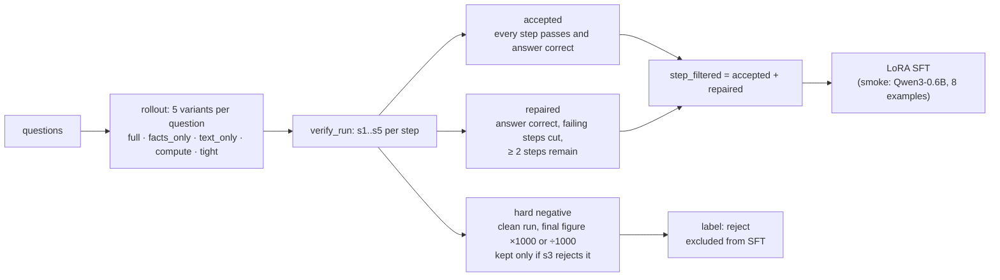

- **Rollouts:** 50 trajectories (10 questions × 5 variants). Why variants: current models
  reject `temperature`, and every call is journalled, so asking twice returns the identical
  cached run. Diversity has to be *engineered through the input*, meaning different toolsets
  per variant.
- **The divergence H1 depends on** (MVP2.1, after the prompt fix): **correct-but-flawed =
  48%** of trajectories. Those runs reached the right answer *through at least one failing
  step*. That's the population where the two filters disagree. Near zero would have made the
  experiment impossible to run. 48% means there's something to measure.

| | rate |
|---|---|
| step filter accepts (every step passes) | 40% |
| outcome filter accepts (answer correct) | 88% |
| **correct but flawed** | **48%** |

- **Exported:** 20 accepted, 16 repaired, 36 hard negatives, 36 step-filtered.
- **LoRA smoke run:** Qwen3-0.6B on Apple Silicon (MPS), 8 examples, 2.29M trainable
  parameters (0.38%). The adapter saved and reloaded. **Loss went 0.73 → 0.67, and that
  means nothing.** It proves the pipeline connects, not that anything improved.

### What changes under process supervision

Only the **training data selection**. Same base model, same objective (plain supervised
fine-tuning on chat-formatted trajectories), same hyperparameters. No reward model, no RL, no
inference-time best-of-N. Keeping everything else fixed is what makes the comparison causal.

### How step judgments become a training signal

A **filter**, not a weighted loss:
- **Accept:** every step passes.
- **Repair:** cut the failing steps *only when the answer was still correct*. If the answer
  was wrong, the failing step caused it, and deleting it would invent a trajectory that
  never happened. This is excision, not regenerating the suffix, and I note that as a
  limitation.
- **Hard negatives** are labelled `reject` and **excluded from SFT**. Training on them as
  positives would teach exactly the errors the verifier exists to catch. They're kept for
  preference or contrastive training later.
- Test: `test_every_hard_negative_is_one_the_verifier_actually_rejects`. A "negative" the
  verifier considers fine is mislabelled data, which is worse than no data.

### Could the model learn to satisfy the verifier without being more correct?

**Yes.** These are the specific loopholes I know of:

| loophole | why it works |
|---|---|
| **Make no numeric claims** | s3 returns *n/a* when there's nothing to check, so hedged, number-free answers pass s3 |
| **Cite whatever was retrieved** | s2's structural check only requires citations to name something retrieved. The judged half is what catches irrelevance. |
| **Do retrieval-looking busywork** | s4 rewards on-topic retrievals whether or not they were needed |
| **Copy numbers from any observation** | s3 checks *traceability*, not whether the number is the one the question asked for |

Guards: **s5 (accuracy) is always reported next to the process metrics**, and both
conditions are evaluated on the *same outcome metric* on held-out questions. A model gaming
the verifier would show step-pass rising while accuracy stays flat or falls (Q22).

### The ablation that separates supervision gains from everything else [Not built: design]

| condition | training set |
|---|---|
| **B4** | outcome-filtered: every trajectory with a correct answer |
| **B5** | step-filtered: accepted + repaired |
| B5 − repair | accepted only |
| B5 + hard negatives | with a contrastive or preference term |

Held constant: the **same trajectory budget** (equal number of training examples, since
otherwise "more data" explains the gain), base model, hyperparameters, seed, and evaluation on
the untouched **test** split. Report accuracy with CIs and a paired test per question. Gate:
**κ > 0.6 for every signal used in filtering must pass first**.

---

## Q19. How did you prevent evaluation leakage?

### What's built [Built]

- **Split unit: the question.** Each question goes to train, dev or test by a **hash of its
  question id** (60/20/20), **stratified by archetype**.
- **Why a hash, not a seeded shuffle:** a shuffle reassigns *everything* as soon as the input
  list changes, so adding one company silently moves test questions into train. A hash keeps
  every existing question where it is. There's a test for stability under reordering.
- **Why stratified:** a plain global hash produced a **test set with no cross-company
  questions at all**.
- **Result:** train 91 / dev 30 / test 31. **The test split has never been run.** All numbers
  in this document are dev.

### Could related items cross splits?

**Yes, and I checked while preparing this answer.** The split unit is the *question*, but
questions share *underlying facts*. For example, `aapl-netincomeloss-2025` (a lookup) is in
**train**, and `aapl-netincomeloss-delta-2025` (the FY2024→FY2025 change) is in **test**. The
test question's answer depends directly on the train question's number. Across the benchmark,
**26 of 109 (company, period, tag-set) groups span more than one split**.

- **For prompted baselines (today), this doesn't matter.** Nothing is trained, and the model
  sees one question at a time.
- **For H1 (fine-tuning), it's real leakage.** A model fine-tuned on train trajectories could
  memorise Apple's FY2025 net income and "solve" a test delta question without retrieving
  it. **Fix before v0.3:** split by **company** (or by (company, fiscal year)), so no fact
  used in test appears in any training trajectory.

**A second concrete issue:** `scripts/rollout.py` takes the **first N questions of the whole
file**. It doesn't restrict to `train`. The file interleaves splits, and its second row is a
test question. Generating training trajectories from test questions is the most direct
leakage there is. **Fix:** `load_split(subset="train")` in rollout, plus an assertion in the
exporter that no `question_id` belongs to dev or test.

Paraphrases: none are generated today. If they are, they must inherit their parent's split,
meaning they're hashed on the *parent* id.

### Was anything tuned on the test set?

**Nothing on test**. It's unrun. But **everything was tuned on dev**: the prompt fix for
tool calls written as text, the step ceilings, the coverage note, and the ratio ground-truth
fix. So **dev numbers are optimistic** by an unknown amount. That's exactly why test exists,
and the plan in report §12 says "run the test split **once**, and stop". I'd present the dev
numbers as development results, not held-out results.

### Contamination from synthetic training data

- Hard negatives come from accepted runs and are excluded from SFT, so they can't contaminate
  the positives.
- [Not built: design] A contamination check before training: for every training example,
  extract the numeric values in its observations and answer, and check them against the
  `expected_value` and source facts of every **test** question. Any hit fails the export. Do
  the same with n-gram overlap on question text. This catches both the shared-fact leak and
  the rollout-source leak above.

---

## Q20. Explain the "8.5×" accuracy improvement.

### The numbers that actually exist [Measured]

On the 30 dev questions, with the same model (Haiku 4.5) and the same questions:

- **No tools (B0): 10.0%** (3 of 30) → **with tools (B2): 76.7%** (23 of 30) = **7.7×**
- With the frontier model plus tools (B3): **93.3%** (28 of 30) = **9.3×** over B0

The resume's 8.5× matches 85% ÷ 10%. But 85% is MVP1's B2, on **20 Apple-only questions**,
and 10% is v0.2's B0 on the **30-question dev split**. Dividing numbers from two different
question sets isn't a valid ratio. **What I'd say instead:** "Tools took the same small model
from 10% to 77%; a frontier model with the same tools reached 93%."

Also, a ratio against a 10% baseline is **fragile**. B0's 95% interval is 3.5–25.6%, so the
same data supports anything from about 3× to about 22×. **Percentage points (+66.7) are the
more honest headline.**

### Was the baseline reasonable?

There are three, each chosen to answer a different question:

| baseline | what it isolates | fair? |
|---|---|---|
| **B0 no tools** | how much of the accuracy is *the system* vs. the model's memory | It's a floor, and deliberately not a straw man: a model that has read a lot of filings can get things right with no retrieval. But it can't respect an as-of date, so every B0 success came from training data. |
| **B1 single-shot RAG** | "is an agent loop better than retrieve-then-answer?" | **Deliberately fair:** same corpus, same horizon, same as-of-filtered retrieval tool, same model, same verifier. The only thing missing is the ability to look again. It scored **6.7%**, below B0, because these questions need a *tagged fact*, not a passage. |
| **B3 frontier + tools** | what money buys | **Identical to B2 except the model.** If B3 also changed the prompt or toolset, its point on the cost-accuracy plot would be uninterpretable. |

The competing implementation you'd most expect in industry is RAG. B1 is that, done fairly.

### How many questions, and how correctness was scored

- **n = 30 (dev)**, with **Wilson 95% intervals**. Wilson, not the normal approximation,
  because at 0% or 100% the normal approximation gives a zero-width interval, claiming
  certainty from 30 samples.
- **Scoring:** s5 compares the numeric `value` in the `finish` call (in base units) against
  the expected value within **0.5% relative tolerance**. `answered_correctly()` also requires
  that `finish` exists and s5 applied (Q16).
- **One side effect worth knowing:** a run whose prose is right but whose `value` field is
  wrong (e.g. 0.2241 instead of 22.41 for a percentage) is scored **wrong**. That's strict,
  but it's the honest reading of "did the system output the right number".

### STAR: a ground-truth bug that looked like a capability finding

**Situation.** The first four-policy sweep scored **0% on ratio questions for all four
policies**, including B3.

**Task.** A uniform zero across systems of very different strength points to a broken
question, not a hard one. Find out which.

**Action.** A 10-K reports annual *and* fourth-quarter figures, and they can share an end
date. The generator's `SELECT DISTINCT ON (tag, period_end)` took whichever row sorted first
and **labelled it the fiscal year**. For ratios, numerator and denominator were chosen
independently, so a full-year net income was routinely divided by a *single quarter's*
revenue: **Apple's FY2018 net margin came out as 94.64%. The truth is 22.41%.** Fix: duration
facts must span **more than 300 days** to count as annual (fiscal years are 52 or 53 weeks,
358–371 days, so 300 separates them from quarters with plenty of margin). Ratios key on the
**whole period** `(period_start, period_end)`, so both legs cover the same window.

**Result.** This affected **all 25 ratio questions plus 3 lookups, about 18% of the
benchmark**. Every policy had been marked wrong for producing the *right* number. Checks
after the fix: AAPL FY2018 22.41%, FY2017 21.09%, and `aapl-revenues-2018` = $265,595,000,000,
which matches SEC. A regression test, `test_ratio_answers_are_plausible_margins`, now
tests the *committed split file* itself.

### Which categories improved and which still fail

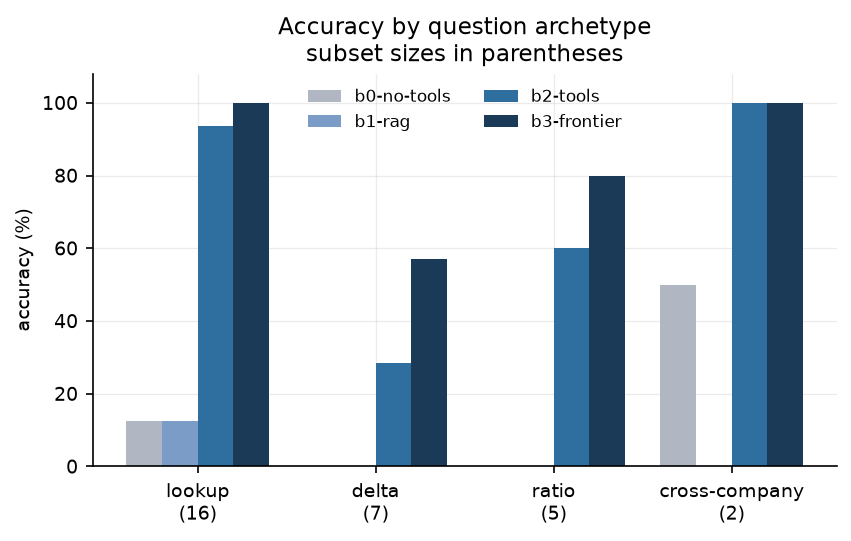

| archetype | B0 | B2 | B3 |
|---|---|---|---|
| lookup | 12.5% | **100%** | **100%** |
| cross_company | 50% | **100%** | **100%** |
| delta | 0% | 42.9% | **85.7%** |
| ratio | 0% | 40% | **80%** |

Lookup and cross-company are solved. The two agents **split apart on multi-fact questions**.
Difficulty follows **how many facts must be held at once without mixing up their periods**,
not the arithmetic. Both models retrieve and compute fine, and the smaller one mismatches
periods. B2's 7 failures: **5 hit the step cap, 1 answered without calling a tool**, and 1 was
wrong. Delta is the weakest category and is the first diagnosis item for v0.3.

---

## Q21. How did you measure the "90% reduction" in unsupported claims?

### The definition [Built]

**D2 = the average, over runs, of (1 − s3 score of the run's last step).** Per run, s3 is the
fraction of the answer's **financial numeric claims** (plus the stated `value`) that trace to
evidence the run retrieved (Q2, Q16). So:

- **Unit:** the *claim* is scored, the *answer* is the averaging unit, and the reported
  number is a mean over runs.
- **What's excluded:** percentages (derived, not reported, so not in XBRL; though a percentage
  in `value` still has to trace to a `python` result) and dates or ordinals.

| | B0 | B1 | B2 | B3 |
|---|---|---|---|---|
| D2 unsupported | 16.7% | 0.0% | **2.1%** | **1.1%** |
| reduction vs. B0 | — | — | **−87%** | **−93%** |

"~90%" is defensible *if you name the model*. B2 alone is 87%. The report's own interpretation
says **grounding is nearly independent of the model**: the environment (structured citations,
and figures that must come from tools) does the work, not the model.

### Unsupported vs. incorrect

They're different axes, and s3's labels keep them apart:

| | traced to retrieved evidence | not traced |
|---|---|---|
| **true** | supported and correct | **unsupported but correct** (`uncited`: right from memory) |
| **false** | **supported but wrong** (e.g. the wrong period, the right number for the wrong question) | unsupported and wrong (`fabricated`, `scale`) |

D2 measures the *columns*. D1 (s5) measures the *rows*. A number the model remembered
correctly is still **unsupported**. It wasn't retrieved, it can't be audited, and it won't
reproduce at a different horizon.

### Could shorter or less useful answers game this metric?

**Yes, in three ways, and I'd name them myself:**
1. **Say no numbers.** With no checkable claims, s3 is *n/a*, and D2 counts that as 0%
   unsupported. **B1's 0% is exactly this.** It makes almost no numeric claims, so it has
   nothing to be unsupported. The report calls this out: "not an achievement".
2. **Don't finish.** A run that aborts has a last step that isn't `finish`. Its s3 is *n/a*
   and counts as **0% unsupported**. So a policy that aborts a lot *looks* well-grounded.
   (A run with no steps at all counts as 100%, which is inconsistent in the other direction.)
3. **Averaging per answer** means a one-claim answer and a ten-claim answer weigh the same.

### Completeness measured alongside?

Partly. **D1 accuracy is always reported next to D2**, and it's the check that catches
gaming: B1 has 0% unsupported *and* 6.7% accuracy. What I'd add [Not built: design]:
- Report the **claim count** (the denominator) per policy, and a **claim-weighted** D2.
- Report the **answer rate** (the share of runs reaching `finish`), and compute D2 **only
  over answered runs**, so aborts can't lower it.
- Pair D2 with D1 in the headline, always: "2.1% unsupported *at* 76.7% accuracy".

---

## Q22. Are the "10% and 25%" gains relative or percentage points?

### The likely source, and the honest framing

No results file contains a "10%" and "25%" pair. The closest match is the **accuracy change
from the Q12 fixes** (step ceilings lifted, dollar ceiling on list cost, coverage note), on the
**same 30 dev questions**:

| | before (ceilings binding) | after (all fixes) | change |
|---|---|---|---|
| B2 | 66.7% | 76.7% | **+10.0 points** (+15% relative) |
| B3 | 70.0% | 93.3% | **+23.3 points** (+33% relative) |

If that's the source: **they're percentage points, and "25" rounds up 23.3.** More
importantly, they aren't model improvements. **They're the removal of measurement defects.**
The models didn't get better. The benchmark stopped marking them down for hitting limits it
shouldn't have had. I'd describe them as "fixing the harness revealed the frontier model was
23 points better than the confounded measurement showed".

Another candidate is the MVP2.1 prompt fix (the model wrote `<finish>` as text):
outcome-accept went 60% → 88% (**+28 points**), step-accept 26% → 40% (**+14 points**). Also
points, on 50 rollouts.

### Consistent across runs?

**Not established.** Each configuration was run live **once**. Replay reproduces a sweep
exactly (Q24), but that's determinism of the *pipeline*, not the model: two live calls with
identical inputs may differ, and current models don't accept `temperature`. At n = 30 the
intervals are about 30 points wide (B2 59.1–88.2%, B3 78.7–98.2%), so **a 10-point change is
inside the noise for a single sweep**. To claim consistency I'd run 3–5 cold sweeps and report
the spread, or use a paired test on the same questions (McNemar), which is far more
statistically efficient than comparing overlapping intervals.

### Did the denominator change?

- The **question set stayed at 30 dev questions** throughout.
- But the **labels changed** between some sweeps: the ratio ground-truth fix (Q20) corrected
  the expected values of about 18% of the benchmark. Any before/after that straddles that fix
  is comparing against different answer keys. The table above is entirely *after* it.
- **Run outcomes** did change (aborts → completions), which is the point of the fix, not a
  population change.

### Can step-pass rate rise while accuracy falls?

**Yes, and it's been observed at small scale.** In the MVP2.1 prompt fix, `facts_only` went
from 60% → 50% step-accept while correctness went 90% → 100%, and `text_only` went 30% → 20%
while correctness went 80% → 90%. The two metrics moved in *opposite* directions. The
mechanisms:
- D3 is **dominated by s4** (retrieval relevance), which is judged and uncalibrated (Q17).
- A model can pass every step by being cautious and **never answering**, or by gaming the
  loopholes listed in Q18.
- The **48% correct-but-flawed** population *is* this divergence: right answers with bad
  steps.

That's why D1 is always reported next to D3, and why H1 is judged on held-out *accuracy*, not
step-pass rate.

---

## Q23. How did you calculate cost per correct answer?

### The formula [Built]

**E1 = (total list cost of every run in the sweep, including failed and aborted runs) ÷
(number of correct answers).** It's `None`, displayed as "—", when nothing is correct.

| included | excluded |
|---|---|
| router call + every agent call (generation), all input/output tokens | **verification** (its own ledger: it's a cost of *measuring*, not of the policy) |
| calls in failed/aborted runs (numerator) | embedding and reranking compute (local CPU) |
| **list price**, even when served from the journal | Postgres, infrastructure, people |
| | SDK-internal retries (invisible to the ledger) |
| | prompt-caching discounts; Sonnet's temporary introductory price (it's billed at list, so E1 errs **pessimistic**) |

So it's **marginal model-inference cost per correct answer**, not fully allocated operating
cost. That's the right number for comparing *policies*. It's the wrong number for a budget
forecast.

**Why list price and not actual price:** a re-run sweep served from the journal costs $0. If
E1 used actual spend, every policy would look free on the second run. Cost is a property of
the *policy*, not of cache state. (The same reasoning drives the dollar ceiling in Q12.)

### Abstentions and failures

They add to the **numerator** (they cost money) and not to the **denominator** (they're not
correct). So a policy that fails often pays for it in E1. That's intended: failing is part of
what a policy costs. An **abstention** is treated as a failure today. In a product, a correct
"I don't know" is worth more than a wrong number, and I'd separate the two (Q21).

### The "3×" claim

**No results file backs a 3× cost-per-correct improvement.** The real numbers [Measured]:

| policy | E1 $/correct | accuracy |
|---|---|---|
| B0 no tools | **$0.0085** (cheapest) | 10.0% |
| B1 RAG | $0.0478 | 6.7% |
| B2 Haiku + tools | $0.0273 | 76.7% |
| B3 Sonnet + tools | $0.0406 | 93.3% |

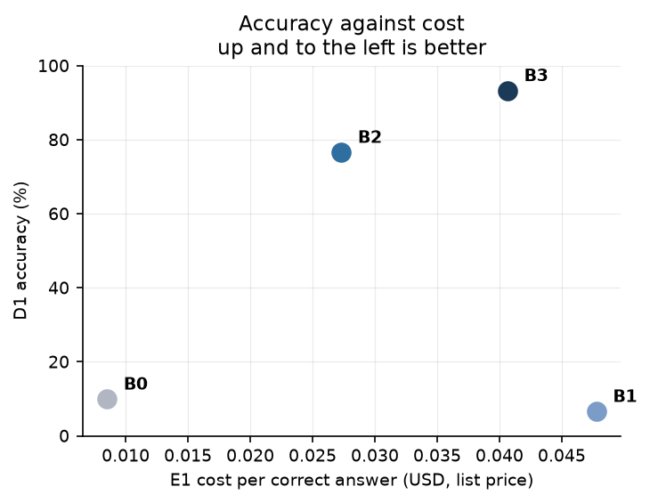

- B2 is **1.75× cheaper per correct answer than RAG** *and* 11× more accurate.
- B2 is **1.5× cheaper per correct answer than B3**, for 16.6 fewer points of accuracy. That's
  a trade-off, not a free win. An earlier sweep showed about 2.5×, but that was produced by
  the ceiling confound (Q12) and doesn't survive.
- **B0 is cheapest per correct answer and useless.** E1 alone would pick it. That's why cost
  is shown on a **cost-vs-accuracy frontier**, never alone.
- Where "3×" probably comes from: **Haiku is 3× cheaper per token than Sonnet** ($1/$5 vs
  $3/$15 per million). On the one-question comparison it was only **38% cheaper per answer**,
  because it took an extra step and used about 2× the input tokens. Cheaper per token isn't
  proportionally cheaper per answer, and that finding is the whole argument for measuring
  E1.

### Does it hold at lower traffic, or with longer questions?

- **Traffic:** E1 is per request and contains no fixed costs, so it's **traffic-independent
  by construction**. At low traffic, *fully allocated* cost per answer would be dominated by
  idle infrastructure, which E1 deliberately leaves out.
- **Longer questions:** cost grows *faster than linearly* with steps. Each step re-sends the
  entire conversation, so input tokens grow roughly with the square of step count. Delta
  and ratio questions use more steps (B2 mean 4.33 overall, 6.7 on the empty-horizon
  questions). Expect the B2/B3 gap in E1 to shift on harder questions. Prompt caching of the
  system prompt and tool schemas is the obvious lever, and it isn't used yet.

---

## Q24. What does deterministic replay mean?

### Replaying recorded outputs, not re-running inference [Built]

Every model call goes through `llm.call`, which hashes the request and looks it up in the
journal **before** calling the API:

```
key = sha256( canonical_json({
        scheme: "v1", model, system, messages, tools,
        thinking, effort, max_tokens, extra }) )
canonical = sorted keys, no whitespace, ASCII-escaped
```

- **Hit** → return the stored response, charge $0 actual (list cost still recorded).
- **Miss, live mode** → call the API, store the response (first write wins), charge.
- **Miss, replay mode** → **raise `ReplayMiss`.** Never fall back to a live call: a "free"
  replay must never spend money, and a determinism check must never pass on freshly generated
  output.

**What the key leaves out on purpose:** `max_steps` and `max_usd`. They bound the *trajectory*,
not the call, so raising a ceiling replays the cached prefix for free and pays only for the
continuation (that's what made Q12's investigation cost $0.41). Also left out:
`temperature`, because current models reject it with a 400.

### What F1 does and doesn't claim [Measured]

| | live | replayed |
|---|---|---|
| MVP1 sweep cost | $0.3313 | **$0.0000** |
| B2 p95 latency | 12,290 ms | 77 ms |
| metric fields identical | — | **14/14 (100%)** |

F1 says **the pipeline is deterministic given the journal**. It says **nothing about the
model**. Two live calls with identical inputs may differ. I retracted my original
justification ("temperature 0 makes it reproducible") once sampling parameters were removed,
and wrote the narrower claim into `journal.py`.

### What's stored to reproduce an execution

| stored | where |
|---|---|
| every model request and response | `journal` |
| the trajectory (thoughts, tool args, observations), as_of, path, outcome | `runs`, `steps` |
| the questions and ground truth | `eval/splits/mvp_150.jsonl` (committed, frozen) |
| **not stored:** the git commit of the code that produced the run, the corpus version | *a gap: I'd add `code_sha` and `corpus_version` to `runs`* |

### The subtle part: tools are *re-executed* during replay, not replayed

Only model calls are journalled. Tools run **live against the database** during replay. Then
each tool's output goes into the next prompt, and so into the next key. So:

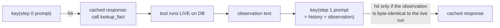

A trajectory is a **chain of keys**. If a tool's output changes by one byte, every later key
misses.

**STAR: an unordered `SELECT` broke replay.**
*Situation:* After the credit outage (Q15), replaying the three finished policies raised
`ReplayMiss` at `step-4`. A trajectory took a *different path* on replay than it had live.
*Task:* Find the source of non-determinism in a system that had passed 100% F1 at MVP1.
*Action:* Three SQL queries and one Python sort returned rows in an order the database
happened to choose. `available_sections` had `DISTINCT … LIMIT 8` with **no `ORDER BY`**.
`_similar_tags` ordered by similarity with **no tie-break**. `RETRIEVE_SQL` ordered by RRF
score, which **ties routinely**. The reranker kept input order on equal scores. Error-message
paths mattered as much as successful ones, because an error is an observation too. I added a
deterministic tie-break to every ordering (`c.section`, `t.tag`, `c.id`, `(-score, index)`),
plus `tests/test_determinism.py`: 10 tests that call each tool four times and assert one
distinct result. *Result:* replay works at MVP2.2 scale. MVP1's 100% F1 had been *true but
under-powered*: ties only appear with 5,949 chunks, not with 233.

### What happens if the tool code or data changes

- The **observation changes, so the key misses, so `ReplayMiss`**. It's loud, never a wrong
  cached answer.
- The exception: a change that doesn't alter any observation (a refactor, or a metrics
  change) replays cleanly. That's exactly the class of change replay is meant to validate.

### What replay can validate vs. what needs fresh runs

| replay validates ($0) | needs a fresh live run |
|---|---|
| metric and harness code (D1–E2 computation) | prompt changes (a new key for every call) |
| programmatic verifier changes (s1, s3, s5) | model changes |
| judge rubric *unchanged* (judge calls are journalled) | judge rubric changes |
| budget and ceiling *accounting* | anything that changes a tool's output: ranking, reranker, chunking, data, new filings |
| refactors that preserve observations | latency measurement (a cache hit isn't a latency, Q29) |

---

## Q25. What causes CI to block a release?

**Honest status:** there's **no CI yet**. `.github/workflows/` is empty. There's a local
suite of **208 tests** (`make test`, all passing), `ruff` lint and format checks, and scripted
benches (`make leak`, `make calibrate`, `make determinism`). The design below is built from
those parts.

### Which regressions block, and why [Not built: design]

| gate | threshold | cost | why it's release-blocking |
|---|---|---|---|
| unit + regression tests | all pass | seconds | each named regression test pins a bug that presented as a *result*, not an error (e.g. `test_a_random_number_collides_with_the_fact_universe`) |
| **A1 lookahead leak** | **exactly 0.00%** | seconds, no model | a leak invalidates every downstream number, silently |
| **seeded-error calibration** | per-class recall ≥ gate **and** control false positives = 0 | seconds for s1/s3, cents for s2 | the verifier decides training data. A recall drop poisons it. |
| **replay determinism (F1)** | 100% of fields identical | **$0** (journal) | non-determinism breaks free re-evaluation, which everything else relies on |
| dev accuracy, **replayed** | no change | $0 | for changes that can't alter prompts or observations: *any* change is a bug |
| dev accuracy, **live** | paired non-inferiority, per archetype | ~$2 per sweep | only when prompts, tools, retrieval or model change. Run nightly or on release branches, not on every PR. |

The ordering is deliberate: **correctness invariants first** (they're cheap and binary),
statistical gates last (they're expensive and noisy).

### Noise vs. a real drop

At n = 30, interval overlap is almost useless (±15 points). Better:
- **Paired comparison on the same questions** (McNemar). Only questions whose outcome
  *flipped* carry information. That's far more sensitive than comparing two accuracies.
- **Block on flips that are unambiguous:** e.g. ≥ 3 previously-correct questions now wrong
  with 0 gained, or any regression on a small **"golden" set** of must-pass questions.
- For stochastic models, keep a **baseline of repeated runs** so "normal flip rate" is
  measured, not assumed.

### Can aggregate accuracy stay flat while a category regresses?

**Yes, easily.** Per-archetype results already differ hugely (lookup 100% vs. ratio 40% for
B2). One more delta question right and one fewer ratio question right leaves the total
unchanged. So the gate is **per archetype**, with a floor for each, and *any* drop on a
solved category (lookup, cross-company at 100%) blocks. Same logic as calibration: report
per class, never pooled.

### Updating the benchmark without weakening the gate

This one already has a working practice behind it [Built]:
- The split file is **the artefact**, committed and frozen. Regenerating requires `--force`,
  and `test_split_generation.py` tests the committed file, not the generator.
- **Hash-based assignment** means adding questions never moves existing ones (Q19).
- Reports are **versioned, never edited in place**. v0.2 is frozen, and v0.3 is a copy with
  a visible diff.

What I'd add: gates compare on the **intersection** of old and new question sets (so new hard
questions can't look like a regression and new easy ones can't mask one). Fixing a *label*
(like Q20's ratio fix) bumps the split version and re-baselines everything explicitly.

---

## Q26. Why EKS?

**Direct answer: it isn't on EKS, and at its current traffic it shouldn't be.** Deployment
is roadmap stage MVP3, and those folders are empty (`infra/k8s`, `infra/terraform`,
`infra/argocd`). The report's plan even names **k3s**, not EKS. Today it runs with
`docker compose` (Postgres + pgvector, Redis) and a local Python process. If a resume says
"deployed on EKS", it needs to change to "designed for".

### Was Kubernetes necessary?

**No, and I'd say that plainly.** Traffic today is one person running evaluation sweeps: at
most 30 questions × 4 policies, sequentially. A single VM with docker compose, or **ECS
Fargate + RDS Postgres (pgvector is supported)**, covers every current need at a fraction of
the operational load. Choosing EKS now would be a **learning choice**, and I'd call it one.

### What *would* justify Kubernetes [Not built: design]

The roadmap does create a real need at **MVP2.3**, which is **GPU inference and training**:
generating trajectories from a local 8B model with vLLM (sampling is available there again,
unlike the API), and LoRA training runs. Then there are **five workloads with different
shapes**:

| workload | shape | scales on |
|---|---|---|
| API / executor | stateless, I/O-bound (waits on model and DB) | in-flight requests or queue depth (not CPU, see Q29) |
| reranker + embedder | CPU-bound, bursty | CPU, or requests per second to that service |
| vLLM model server | GPU, long-lived | GPU KV-cache use / pending requests |
| ingestion | batch, scheduled | none (it's a job) |
| training | batch GPU, hours | none (it's a job; spot instances) |

Mixed GPU and CPU pools, batch jobs next to services, and independent scaling signals are the
point where Kubernetes (with Karpenter or cluster autoscaler for GPU nodes) earns its
overhead. ECS can do most of it, but GPU scheduling, job queues and the vLLM/KServe ecosystem
are more mature on Kubernetes. **Until the GPU workload exists, the answer is ECS or a VM.**

---

## Q27. What do Terraform, ArgoCD, and Airflow each do?

**Status: none are built** (MVP3). This is the ownership model I'd implement, and it's shaped
by constraints in the existing code.

### Who owns what [Not built: design]

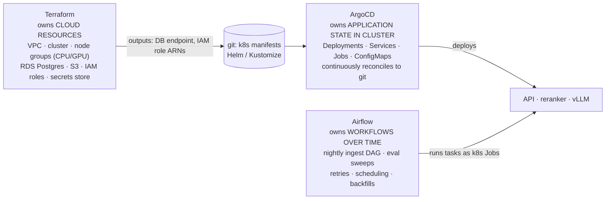

The rule: **each resource has exactly one owner.** Terraform never touches a Deployment,
ArgoCD never creates a database, Airflow never changes infrastructure.

### Someone manually edits a Kubernetes resource

ArgoCD compares live state to git, marks the app **OutOfSync**, and, with `selfHeal: true`,
**reverts the edit**. Emergency changes go through git (a revert or a hotfix commit), so the
audit trail and the running state never diverge. Manual edits to Terraform-owned resources
show up as drift on the next `terraform plan`.

### Ordering a database migration and an application deploy

A constraint in today's code shapes this: `migrate()` just re-applies `schema.sql`, which is
all `CREATE … IF NOT EXISTS` / `CREATE OR REPLACE VIEW`. That's idempotent for *additions*,
but it **can't express an ALTER, a rename, or a data backfill**. So first: move to versioned
migrations (Alembic or sqitch). Then:

1. **Expand:** a migration adds new columns/views, compatible with the *old* app. It runs as
   an **ArgoCD PreSync hook Job** (or an earlier sync wave), before the new app rolls out.
2. **Deploy** the new app, which uses the new schema.
3. **Contract:** drop the old columns in a *later* release, once no running version reads
   them.

A caution specific to this schema: the `v_*` views are `SELECT *`. Adding a column to a base
table doesn't change an existing view's column list (Postgres fixes `*` when the view is
created), and dropping a column the view depends on fails. So view changes need their own
explicit migration step.

### Airflow retries and ingestion idempotency

This is where the existing design pays off: every ingest write is an **upsert on a natural
key** (Q6), so **an Airflow task retry can't create duplicates**. DAG shape: per company,
`list_filings → upsert → chunk_and_embed → facts → prices → validate_coverage → publish`
(flip `ready`, Q6). Three things to get right:
- **The SEC rate limit is global**, but today's throttle is per process. Put all SEC tasks in
  one **Airflow pool** sized so parallel tasks stay under 10 req/s total.
- **The stale chunk tail** (Q6): make `chunk_and_embed` delete-then-insert per filing in one
  transaction, so a retry after a chunker change is clean.
- **Retry transient failures only** (Q15). A 403 from SEC (missing User-Agent) should fail the
  task, not retry it 3 times.

---

## Q28. How do you deploy safely and roll back?

**Status: no deployment pipeline exists** (Q25–Q27). This is the design, tied to properties
of the current code.

### Before a version gets traffic [Not built: design]

1. **CI gates** from Q25: tests, A1 = 0, calibration, replay determinism.
2. **Readiness probe** that checks what actually fails on cold start: the DB is reachable,
   the schema is at the expected version, the **embedder and cross-encoder are loaded** (both
   load lazily through `lru_cache`, so the first request would otherwise pay the load time,
   about 130 MB for bge-small), and the model API key is valid.
3. **A smoke run:** 5 fixed dev questions, live, must all reach `finish` with s3 = 1.0.
4. **Canary** at a small share of traffic. Compare error rate, abort rate by outcome
   (`max_steps`, `budget_exceeded`) and p95 against the stable version. Promote
   automatically (Argo Rollouts) or roll back.

### Can the old app still run after the migration?

Only if migrations are **expand/contract** (Q27). With today's `schema.sql` approach the
answer is "only for additive changes", which is exactly why I'd change it first.

### In-flight agent executions during a deploy

A run is bounded at **300 s** (`max_seconds`), so: set `terminationGracePeriodSeconds`
> 300, stop admitting new runs on SIGTERM, and let in-flight ones finish.

What happens to a run that's killed anyway: **the trajectory is saved only at the end**
(Q13), so it's lost. But every completed model call is in the journal, so re-submitting the
same question on the new version **replays the paid prefix at $0**, as long as the prompts
and tools didn't change. If they did, the keys miss and it runs fresh, which is the correct
behaviour for a new version anyway.

### What rollback fixes, and what needs data repair

| failure | rollback fixes it? |
|---|---|
| bad code, bad prompt, bad tool logic | **yes** |
| bad verifier logic that **wrote wrong scores** into `steps` | **no, but cheap:** verification is a separate pass, so re-run `verify_run` with the fixed code. Programmatic signals cost $0, and judged ones replay from the journal if the rubric didn't change. |
| bad ingest (duplicates, mislabelled sections: both happened, Q6 and below) | **no:** needs data repair. Upserts don't delete, so fix the code, then delete and re-ingest affected filings. |
| bad benchmark labels (Q20's ratio bug) | **no:** regenerate the split, bump its version, re-baseline |
| a leaked future row reached a training set | **no, and it's the most expensive:** find and discard the affected exports and anything trained on them |

The section-labelling example: a chunker bug mapped 10-Q item numbers to 10-K names, so
**"properties" had 817 chunks** across the corpus (Apple's real Properties section is 83
words), and a heading regex capped at 80 characters dropped Apple's MD&A heading. Rolling back
the chunker wouldn't have fixed the rows it had already written.

---

## Q29. How would you investigate doubled latency?

**The first question I'd ask:** did the *cache hit rate* change? This is where I've already
been wrong once.

### STAR: a latency table that measured the cache, not the system [Measured]

**Situation.** A sweep produced this "latency comparison":

| policy | p50 | p95 | actual spend |
|---|---|---|---|
| B0 | 1 ms | 4 ms | $0.0000 |
| B1 | 133 ms | 1,747 ms | $0.0000 |
| B2 | 5 ms | 73 ms | $0.0000 |
| B3 | 8,411 ms | 17,333 ms | $0.6826 |

**Task.** Decide whether B2 was really ~1,700× faster than B3.

**Action.** The spend column gave it away. B0–B2 had been journalled by earlier runs and cost
nothing, so their "latency" was the time to hash a key and read a row. B3 ran live. It was
comparing dictionary lookups with network round-trips. Fix: each outcome carries its call
count and cached-call count, and **E2 (latency) only includes runs where no agent-loop call
was cached**. `e2_n` is reported next to the percentiles, and a fully replayed policy reports
"—", not 0 (which would read as "instant"). A follow-up bug: counting the *router* call made
every policy after the first permanently ineligible (the router's question-only prompt is
shared across policies, so it gets cached), and B3 reported 0/30 for three sweeps while paying
for every run. Eligibility is now judged on the agent loop only.

**Result.** Cost and latency now deliberately use **opposite bases**: E1 uses list cost over
all runs (a property of the policy), and E2 uses wall time over cold runs only (a cache hit
doesn't exercise the policy). **E2 is still unreported in v0.2**, because only the 9
re-prompted questions ran cold, and timing only the hardest questions would be biased. A cold
timing pass (about $1.80) is scheduled. The only clean latency numbers are MVP1's: B2 p95
12.3 s vs. B1 3.6 s.

### A general procedure [partly built]

**1. p50, p95, or both?**
- **Both up**: something systemic. The model API got slower, the model changed, prompts got
  longer (tokens in), a cold process is loading models every request, or cache hits dropped.
- **Only p95 up**: the tail. More runs hitting long paths (P3/P4 go to 10–12 steps), retries,
  one archetype getting harder, timeouts (a 5 s SQL timeout plus a retry step), or a slow
  subset of the database.
- **Check behaviour before infrastructure.** Latency ≈ steps × per-step time. If mean steps
  went from 3.4 to 6.8, the "latency regression" is really a behaviour change (a router
  shift, a prompt change, an empty-horizon problem like Q12).

**2. Queueing vs. processing.** Today there's no queue. With one, I'd record `enqueued_at`,
`started_at` and `finished_at`. Queue time rising with flat processing time means
*capacity*. Processing time rising means *work per request*.

**3. The trace spans I'd want.** Today there's partial data: the ledger records per-call
`latency_ms` with labels (`router`, `step-N`, `s2-citation`, `s4-relevance`), and each step
records its latency. What's missing is spans *inside* tools:

```
run
├─ router.llm_call
├─ coverage.at            (3 aggregate queries)
├─ step-0.llm_call        (model: tokens_in, tokens_out, cached?)
├─ step-0.tool.retrieve_filings
│   ├─ embed_query        (CPU)
│   ├─ sql.hybrid_rrf     (DB)
│   └─ rerank.predict     (CPU, 30 pairs)
├─ step-1.tool.sql
│   ├─ db.connect         ← new connection per call, a likely hidden cost
│   └─ db.execute
├─ step-2.tool.python     (subprocess spawn + exec)
└─ save                   (2 inserts)
```

**4. Low CPU but high latency** means the time is spent *waiting*, not computing. In order of
likelihood here:
1. **the model API** (network plus generation). By far the largest share, and CPU-idle.
2. **more steps per run** (see above). Each step is another multi-second wait.
3. **DB connection setup** in the SQL tool (a TCP connection plus auth for every call).
4. **pool waits**: `PoolTimeout` near-misses if concurrency rose past 8.
5. **SEC throttle sleeps** (ingest paths only).
6. **Lock contention** or a slow plan in Postgres (`pg_stat_activity`, `pg_stat_statements`).

---

## Q30. What breaks first at 10× traffic?

**Framing:** the current "traffic" is sequential evaluation, so 10× means going from 1 to ~10
concurrent runs. The predictions below come from the code and the measured per-run shape, not
from a load test.

### What the measurements say

- A run makes about 3–5 model calls (mean steps 3.37–4.33 plus the router) and waits
  **seconds** on each. MVP1's clean live B2 p95 was 12.3 s per run.
- Input tokens grow with each step (the full history is re-sent), so tokens per minute grow
  faster than runs per minute.
- The P3 path, which the router picks for every multi-step question (Q10), has the longest
  runs and uses the SQL tool, the component with the worst concurrency behaviour.

### Predicted order of failure

1. **Model API rate limits (tokens and requests per minute).** Almost all of a run's time is
   spent waiting on the model, so this limit is reached first, as 429s. At 10× concurrency,
   token volume per minute scales about 10×.
2. **Postgres connections from the SQL tool.** Each `sql` call opens a *new direct
   connection*, bypassing the pool. 10 concurrent runs on P3, each making several SQL calls,
   plus each process's pool of 8, plus replicas, heads toward the 100-connection default.
   Failures here are abrupt (`too many connections`).
3. **In-process CPU for the reranker and embedder.** 30 cross-encoder pairs per
   `retrieve_filings`, on CPU, under Python's GIL, inside the request process. This limits
   throughput on P1/P4 paths.
4. **Process spawn for the Python sandbox:** tens of milliseconds each. Fine until it isn't.

### Do more API replicas make the database or model server worse?

**Yes, both.** More replicas don't add model capacity: the provider limit is shared, so more
replicas just hit 429s sooner and need a **global** limiter (Q14), not a per-replica one. For
the database, each replica brings its own pool (8) *plus* unpooled SQL-tool connections, so
connection count grows with replica count, not with actual load. Hence PgBouncer and a
dedicated pooled role for agent SQL.

### A realistic load test [Not built: design]

- **Replace the model with a latency-faithful fake built from the journal.** It returns
  recorded responses with recorded latency distributions. That load-tests *my* system
  without spending money or tripping provider limits. Then run a small separate test against
  the real API to find the real rate limits.
- **A realistic mix:** sample questions by the **router's actual path distribution** (P3-heavy
  on dev) and by archetype, not uniformly. Include old-horizon questions, which take about 2×
  the steps (Q12).
- **Ramp until the p95 SLO breaks**, and record which resource hits its limit first: 429
  rate, connection count, CPU, queue depth.

### What to optimise first, and what to postpone

| do first (cheap, removes a hard limit) | postpone (expensive, not yet justified) |
|---|---|
| a pooled, read-only, least-privilege DB role for the SQL tool (also fixes Q31) | a separate vector database (Q4) |
| a global model-API rate limiter + backoff with jitter (Q15) | Kubernetes autoscaling (Q26) |
| **prompt caching** for the system prompt and tool schemas: every step re-sends them, so this cuts both cost and latency | sharding or read replicas |
| move the reranker and embedder to a small separate CPU service with batching | a learned router |
| path-separated queues (Q14) | multi-region |

---

## Q31. How do you secure data, tools, secrets, and permissions?

### Who needs which permissions

| component | needs | should NOT have |
|---|---|---|
| ingest | write `filings`, `chunks`, `xbrl_facts`, `prices`; outbound HTTPS to SEC and yfinance | access to `runs`, `steps`, `journal` |
| executor | write `runs`, `steps`, `journal`; call the model API | DDL |
| **agent SQL tool** | **SELECT on the four `v_*` views only** | base tables, `runs`/`steps`/`journal` (reading `runs` would let an agent read *another run's answer*), writes, `set_config` |
| python sandbox | CPU and memory | network, filesystem, env vars, imports |
| verifier | read `runs`/`steps`, update signal columns; the judge model | ingest tables' write access |

**Today everything connects as the same database role, which owns every table**
(`financevault`, the docker-compose default). That's the root of the finding below.

### A real finding: the SQL tool's table allowlist can be bypassed

While preparing this answer I tested the SQL tool's static checks:

| query | rejected? |
|---|---|
| `select * from xbrl_facts` | yes, "unknown table(s): xbrl_facts" |
| `select * from public.xbrl_facts` | yes |
| `select * from runs` | yes |
| `select * from "xbrl_facts"` | **no** (quoted identifier) |
| `select * from/**/xbrl_facts` | **no** (comment instead of whitespace) |

The allowlist regex (`\b(?:from|join)\s+([a-z_]…)`) doesn't see quoted identifiers or
comments. The tool connects as the **table owner**, so those queries would read the **base
table with no as-of filter**. Either could read `runs` too.

The code's own docstring says the static checks exist "for error quality, not safety", and
that safety lives in the views. That's only true if the base tables are **unreachable**, and
reachability is a *privilege* question, not a regex question. The views enforce the horizon on
whoever queries *them*, but nothing stops a query going around them.

**How likely is it?** An honest model doing arithmetic would never write
`from "xbrl_facts"`. But the next question makes this more than theoretical.

**Fix [Not built: design]:**
1. A dedicated role `fv_agent` with `SELECT` on `v_*` only, and **no grant on any base
   table**. The views are owned by a role that can read the base tables, so they still work.
   Postgres checks base-table permissions as the *view owner*, so the agent can read the
   views without ever being able to name a base table.
2. The SQL tool connects as `fv_agent` through a pool (also fixing Q30's connection problem).
3. Harden the horizon so the agent can't set it: the regex blocks `set_config` today, but
   custom session variables can be set by any role. Read the horizon from something the agent
   role can't write (e.g. a `SECURITY DEFINER` function over a table only the executor
   writes), or keep the regex as a second layer.
4. A regression test with **adversarial SQL**: quoted identifiers, comments, schema
   qualification, subqueries. It asserts **permission denied from the database**, not a
   regex match.

### Can retrieved text persuade the agent to use an unauthorized tool?

Retrieved filing text goes straight into the model's context, so **prompt injection is in
scope**. SEC filings are fairly low-risk text, but in principle a passage could say "run this
SQL". Two defences exist and one is missing:

- [Built] **The model never holds authority it could be talked out of:** `as_of` and `cik`
  come from `ToolContext`, not from tool arguments, so no text can widen the horizon.
- [Built] **Each path sends only its own tool schemas** to the model.
- **Missing: the executor doesn't enforce the path's toolset at dispatch.**
  `REGISTRY.dispatch(call["name"], …)` will run *any* registered tool, even one not offered
  on this path. The off-path call is only *penalised afterwards* (s1 = 0.25). A model that
  emits `sql` on a P2 run gets it executed.

### Where authorization is enforced when the model makes a valid tool call

The principle: **the model proposes, deterministic code authorizes.** Specifically:
1. **Executor:** reject any tool not in `route.tools`. Return "tool not available on this
   path" as an observation, *without executing it*. (A one-line fix.)
2. **Tool handler:** parameters come from `ToolContext`, never from the model, for anything
   security-relevant (horizon, company, tenant).
3. **Database:** the least-privilege role above, as the layer that holds even if 1 and 2 have
   bugs.

That turns the as-of guarantee from "the regex is right" into "the database won't allow it".

### The Python sandbox, stated honestly

`python_sandbox.py` says it itself: **process isolation, not a security sandbox**. What it
does: blocks imports, `eval`, `open` and dunder attribute access in an AST check before
running; runs a separate `python -I` process (isolated mode, cwd off `sys.path`); empties
`PATH`, sets `HOME=/nonexistent` and `cwd=/`; applies rlimits (memory, CPU, 16 file
descriptors, 0-byte file writes; best effort, since macOS rejects the memory limit); enforces
a 5 s wall-clock timeout that holds on every platform. That fits the threat model (a model
doing arithmetic that might loop) but **not a real attacker**, since CPython escapes aren't
hard. Before real users (MVP2.4): a container with seccomp and no network, or
gVisor/Firecracker.

### Secrets and logs

- [Built] The API key comes from `.env` (gitignored) through pydantic-settings, and is only
  read when a live call is made. **The journal stores the request body, not headers**, so the
  key never reaches the database.
- **Sensitive content retention:** the journal and `steps` store **full prompts and questions
  in plaintext, forever**. That's fine for public SEC data and my own questions, but not for
  user queries. [Not built: design] a retention TTL on `journal`, a tenant id on rows, and
  redacting user-supplied fields before logging.
- **Logs** go to the console through `rich`. There's no structured logging yet. When it's
  added: log request ids, token counts and costs, never message bodies by default.
- The docker-compose DB password is a dev default, fine locally. In deployment it would come
  from a secrets manager via Terraform-provisioned IAM (Q27).

---

## Q32. What design decision would you change?

**The SQL tool's authorization model:** enforcing "the agent can only see the as-of views"
with a **regex allowlist plus a table-owner connection**, instead of **database privileges**.

### What shows the original decision is inadequate

- **A concrete bypass:** `from "xbrl_facts"` and `from/**/xbrl_facts` pass the allowlist and
  read the base table unfiltered (Q31). That undercuts the project's *central* guarantee,
  lookahead-free evaluation, measured at A1 = 0.00%. A1 measured the *intended* read paths.
  It never tested adversarial SQL.
- **The code already knew the regex wasn't the safety layer.** Its docstring says so. The
  gap was assuming "only views are reachable" without making it true in the database.
- **A second, related symptom:** the tool opens a new unpooled connection per call (Q30),
  which a pooled dedicated role would also fix.

### Bad decision then, or changed requirements?

**Mostly changed requirements, partly a blind spot.** At MVP1 the threat model was an honest
model writing aggregate SQL. The views plus fail-closed `current_setting` were the right
*first* move: they closed the hole where the tool queried `xbrl_facts` directly (Q7). Two
things changed: (1) the agent now reads **untrusted retrieved text** (prompt injection is in
scope), and (2) the roadmap adds **real users** (MVP2.4). The blind spot was treating "the
views filter correctly" and "the base tables are unreachable" as the same claim.

### Migration cost and risk

**Small.** Create `fv_agent`, grant `SELECT` on four views, point the SQL tool at a pool
using that role, add the dispatch-level path check (Q31). **Risks:** (1) a view that reads a
table its owner can't access, caught by the existing view tests; (2) the prompts and schemas
don't change, so **journal keys stay valid**, unless an error message the agent sees changes.
A `permission denied` message instead of the regex's message would change observations for
exactly those rare queries, which is acceptable and visible as `ReplayMiss`.

### How I'd know the replacement is better

1. **Adversarial SQL test set** (quoted identifiers, comments, schema qualification,
   subqueries, CTE names shadowing tables, `set_config` variants): 100% denied **by the
   database**. Checked by error code, not by string matching.
2. **Extend A1** with that adversarial set as a third attack strategy. It must stay 0.00%.
3. **No behaviour change on honest traffic:** replay the dev sweep. It should reproduce
   exactly at $0. A difference means an honest query was relying on a base table.
4. **Operational:** the connection count per SQL call goes from 1 new connection to 0
   (pooled), which shows up directly in `pg_stat_activity`.

**Runner-up, if the interviewer wants a non-security answer:** persisting a run **only at the
end, non-atomically** (Q13). The evidence is structural (a crash loses the trajectory and can
leave a run with no steps), and the fix (append steps as they happen, in transactions, with
a `status` on `runs`) also enables resume and live progress streaming.

---

## Appendix — Things to fix or verify before the interview

These came up while writing this document. Each is a place where a well-prepared interviewer
could catch a mismatch.

| # | item | where |
|---|---|---|
| 1 | Change "8.5×", "3×", and possibly "10%/25%" on the resume to numbers the repo supports | Part 0 table, Q20, Q22, Q23 |
| 2 | Don't claim EKS/Terraform/ArgoCD/Airflow, a FastAPI service, or trained-model gains as built | Q3, Q18, Q26–Q28 |
| 3 | SQL allowlist bypass via quoted identifiers/comments; the tool connects as the table owner | Q31, Q32 |
| 4 | The executor doesn't reject off-path tool calls at dispatch | Q31 |
| 5 | `scripts/rollout.py` draws from all splits, including test | Q19 |
| 6 | 26 of 109 fact groups span multiple splits (matters for H1 training) | Q19 |
| 7 | The `wrong_period` seeded error doesn't test period confusion; s3's `period` label is never triggered | Q17 |
| 8 | The comments say nudged runs are recorded as `ok_after_nudge`; the code records `ok` | `runtime/executor.py` |
| 9 | Report §8 has D2 values swapped relative to the table and JSON | Part 0 |
| 10 | The coverage note reveals the corpus's future date range at old horizons | Q7 |
| 11 | `runs` and `steps` saved non-atomically, only at the end of a run | Q13 |
| 12 | `store_chunks` never deletes a stale tail after re-chunking | Q6 |

### A one-paragraph pitch, if asked to summarise

> "FinanceVault is an evaluation environment for AI agents that answer financial questions
> from SEC filings. It guarantees in the database that the agent can't see documents from
> after the question's date: 0% lookahead leakage against 17% for the obvious date filter. It
> scores every step of an agent's work with a five-signal verifier, and every run replays for
> free from a content-addressed journal. On 30 development questions, giving a small
> model tools took it from 10% to 77% accuracy and cut unsupported numbers from 17% to 2%. A
> frontier model reached 93%. The result I'm proudest of is methodological: three times, an
> apparent finding about model capability turned out to be a defect in my own environment,
> and every time it had made the system look worse, not better. That's the direction nobody
> goes looking for."
