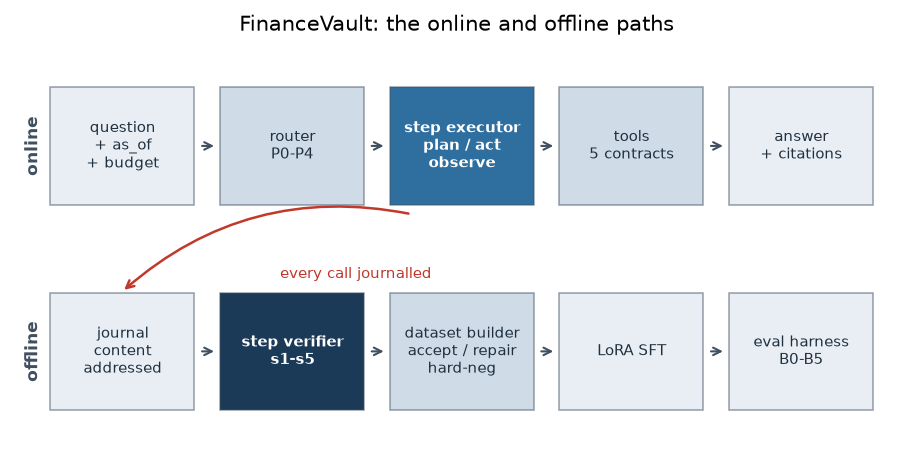
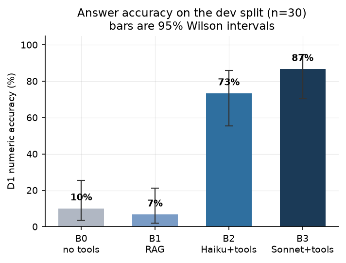
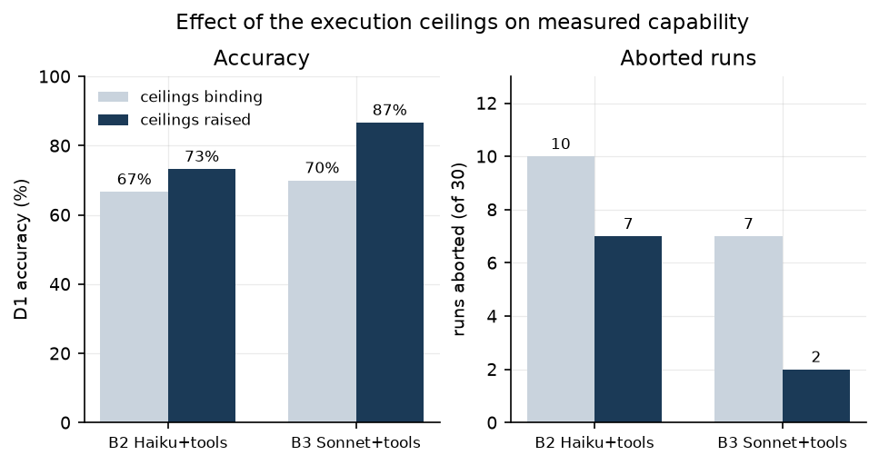
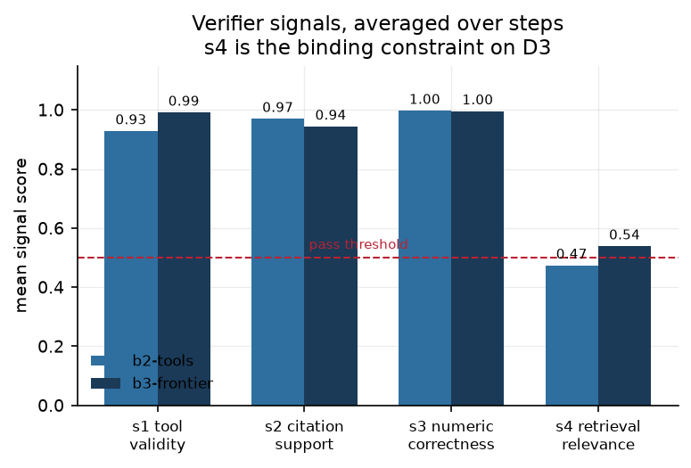
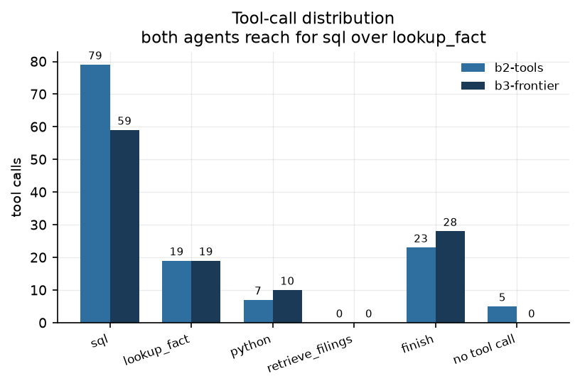
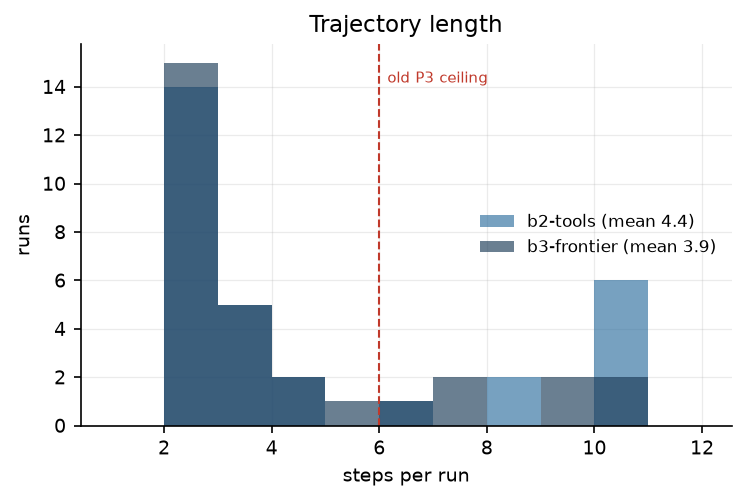

# FinanceVault: A Point-in-Time Financial Tool-Use Environment with Step-Level Verification

**Version 0.2 — MVP2.2, benchmark-complete.** Generated 2026-08-04 from
`eval/results/mvp2.2_dev.json` and the `runs`/`steps` tables. All figures regenerate with
`make figures`.

> **Versioning.** This file is the frozen v0.2 report. The next stage copies it to
> `financevault_v0.3.md` and extends it; every section below carries a **§ status** line
> stating what v0.2 establishes and what the next version must add. No section is edited in
> place across versions — a claim that changes must be visible as a change.

---

## Abstract

**§ status (v0.2).** Complete for the environment, benchmark and prompted baselines. The
hypothesis under test (H1) is not yet evaluated; that is v0.3.

Answering a question about a company's financials is a multi-step problem: locate the filing,
pull the correctly tagged fact, check its unit and reporting period, derive the figure, and
cite the source. Retrieval-augmented generation handles the first step and guesses at the rest.
Tool-using agents do better, but they are trained and evaluated on whether the final answer is
right, which gives no signal about *where* a wrong answer went wrong.

Finance sharpens two failure modes. Numeric errors are silent — an answer off by a factor of a
thousand, or drawn from the wrong fiscal quarter, reads as fluent and correct. And financial
corpora have a time dimension, so a retriever that ignores filing acceptance dates will answer
questions using documents that did not yet exist.

FinanceVault is a tool-use environment over SEC EDGAR and XBRL that enforces point-in-time
correctness in the storage layer, a verifier that scores every step of a trajectory rather than
only its final answer, and a content-addressed journal that makes repeated evaluation free and
byte-deterministic. This version reports the environment (40 filings, 291,266 XBRL facts,
5,949 chunks over 10 companies), a 152-question frozen benchmark with train/dev/test
separation, and four prompted baselines with confidence intervals. On the 30-question dev
split, a tool-using agent on a small model reaches **73.3%** numeric accuracy against **86.7%**
for the same agent on a frontier model, at roughly half the cost per correct answer. Both
reduce unsupported numeric claims to under 2%, against 16.7% for the same model without tools.

The hypothesis the project exists to test — **that filtering agent trajectories at the step
level produces better fine-tuning data than filtering on final-answer correctness, at equal
trajectory budget** — is not evaluated here. This version establishes the instrument.

---

## 1. Introduction

**§ status (v0.2).** Stable. Revisit only if the hypothesis changes.

Three claims motivate the design, in order of how much of the system they dictate.

**Outcome supervision is the wrong granularity for tool use.** A trajectory that reaches the
right answer through a wasted retrieval, a mis-specified SQL query, and a lucky recovery is
scored identically to one that went straight there. Training on the first teaches the detour.
The disagreement between step-level and outcome-level filtering is not hypothetical: on MVP1's
rollouts, **48% of trajectories were correct-but-flawed** — right final answer, at least one
failing step. That population is exactly what the two filters disagree about, and it is large
enough to matter.

**A benchmark over time-stamped documents leaks unless leakage is structurally impossible.**
The natural implementation — filter by date at the call site — fails the moment one call site
forgets. FinanceVault pushes the filter into database views, so a query that does not set the
horizon returns nothing rather than everything (§4.3).

**Evaluation you cannot afford to repeat is evaluation you will not repeat.** Every model call
is content-addressed and journalled, so a sweep re-runs at $0.00. This is not a convenience: it
is what allows a bug found on the fifth sweep to be fixed and the previous four to be
re-derived, which happened repeatedly during this stage (§7).

---

## 2. Background

**§ status (v0.2).** Complete. §2.3 expands in v0.3 with the process-supervision results this
project produces.

### 2.1 Point-in-time correctness

A filing has at least three dates and they mean different things:

| date | meaning | why it is the wrong key |
|---|---|---|
| `period_end` | the last day of the reported period | the figure is not public for weeks or months afterwards |
| `filed` | the date on the filing | can precede public dissemination |
| **`acceptanceDateTime`** | when EDGAR accepted and disseminated it | **the first moment the market could act on it** |

FinanceVault keys everything on `acceptanceDateTime`. A backtest or benchmark keyed on
`period_end` grants the agent information nobody had — the canonical lookahead bias, and one
that inflates results without ever producing a wrong-looking answer.

XBRL adds a second-order version of the same problem: **restatements**. The same
`(cik, tag, period)` is reported repeatedly across filings, with different values. The correct
value at horizon *t* is the most recently accepted one at or before *t*, which requires storing
every version rather than the latest.

### 2.2 Tool-using agents

The agent loop is plan → act → observe, bounded. Each iteration the model sees the question and
the observations so far, and either invokes a tool or finishes. Two properties matter here:

- **The trajectory is a chain.** A tool observation becomes part of the next prompt, which
  becomes the next journal key. A tool that returns rows in a different order does not produce
  a slightly different result; it produces a *different trajectory*.
- **Ceilings are part of the policy.** A run aborted on a step or dollar limit is scored as a
  failure, so the ceiling is silently part of what the benchmark measures. §7.3 documents what
  happened when this was not taken seriously.

### 2.3 Outcome supervision against process supervision

Outcome-filtered SFT keeps trajectories whose final answer is correct. Process-filtered SFT
keeps trajectories whose *every step* verifies. The two differ only on the correct-but-flawed
population, so the value of process supervision is bounded by how large that population is and
by how well the verifier identifies it. That is why the verifier is calibrated (§6.4) before
any training budget is spent.

### 2.4 Why finance rather than mathematics

Process supervision is well studied on mathematical reasoning, where a step is a line of
algebra and correctness is self-contained. Financial tool use differs in ways that change the
problem: a step's correctness depends on *external state* (the right tag, the right period, the
right unit, the right horizon), errors are numerically silent rather than syntactically
obvious, and ground truth is available programmatically from the same XBRL facts the
environment serves. That last property makes three of the five verifier signals mechanical
rather than judged (§6).

---

## 3. Architecture

**§ status (v0.2).** The online and offline paths are complete and exercised. Deployment
(Terraform, k3s, ArgoCD, Airflow, Prometheus/Grafana) is MVP3 and absent here.



### 3.1 The online path

```
question + as_of + budget
        │
        ▼
   ┌─────────┐   one classification call against a fixed rubric,
   │ router  │   committing the run to an execution path P0–P4
   └────┬────┘
        ▼
 ┌───────────────┐  plan → act → observe, bounded by max_steps and max_usd
 │ step executor │◄──────────────┐
 └───────┬───────┘        ┌──────┴──────────────────────────┐
         │                │ tool registry                   │
         │                │  retrieve_filings(query, k, §)  │
         │                │  lookup_fact(tag, period)       │
         │                │  sql(query)      as-of views    │
         │                │  python(code)    sandboxed      │
         │                │  finish(answer, citations, …)   │
         │                └─────────────────────────────────┘
         ▼
  answer + citations

Every step also writes to:
  budget ledger — tokens, dollars, steps, seconds; aborts on breach
  journal       — hash(model, prompt, tools, params) → response
  runs / steps  — the trajectory, with per-step verifier scores
```

### 3.2 The offline path

The journal turns completed runs into training data at no marginal token cost: the verifier
reads trajectories from Postgres, and any run can be replayed byte-identically to inspect an
alternative.

```
runs / steps ─▶ step verifier (s1–s5) ─▶ dataset builder ─▶ LoRA SFT ─▶ eval harness
                                          ├ accepted       (every step passes)
                                          ├ repaired       (failing step excised)
                                          └ hard negative  (clean trajectory, corrupted answer)
```

### 3.3 The leakage guarantee

`AsOf` is a timezone-aware-only value that emits its own SQL predicate and knows which column
is the point-in-time key for each table. Tables with no registered PIT column raise `KeyError`
rather than being silently unfiltered.

The critical decision is that **enforcement lives in database views, not in Python**. The
agent's `sql` tool executes model-written SQL; no Python wrapper can constrain what that SQL
selects. So the tool is granted access only to `v_*` views:

```sql
CREATE VIEW v_xbrl_facts AS
SELECT * FROM xbrl_facts
WHERE accepted_at <= current_setting('fv.as_of')::timestamptz;
```

`current_setting` raises when the parameter is unset, so the view **fails closed**. A query
that forgets the horizon returns an error, never the full table. Base tables are unreachable
from the tool, which also prevents an agent from reading another run's answer out of `runs`.

### 3.4 The content-addressed journal

Every model call is keyed on
`hash(scheme, model, system, messages, tools, thinking, effort, max_tokens, extra)`. Writes are
first-write-wins. In `REPLAY` mode a miss raises `ReplayMiss` rather than going live, so a
replay can never silently spend money.

The key deliberately excludes `max_steps` and `max_usd`: those bound the *trajectory*, not the
call, so raising a ceiling replays the cached prefix for free and pays only for the
continuation. That property is what made §7.3's investigation cost $0.41 rather than $8.

### 3.5 The budget ledger

The ledger tracks two dollar figures, and conflating them corrupts a metric in a way that is
invisible:

| figure | meaning | used by |
|---|---|---|
| `usd` | actually spent — **$0 on a journal hit** | F2, the replay saving |
| `list_usd` | what the same run costs on a cold journal | E1, cost per correct answer; **and the ceiling** |

E1 must use list cost or a re-run sweep reports every policy as free. The ceiling must *also*
use list cost, for a subtler reason: a budget is a property of the policy, so "this run may
spend five cents" has to mean the same thing whether or not the journal is warm. Enforcing on
actual spend made the ceiling vanish on replay (§7.3).

---

## 4. Environment and dataset

**§ status (v0.2).** Corpus and benchmark are frozen at the sizes below. v0.3 does not change
them — a moving benchmark cannot support a before/after claim.

### 4.1 Corpus

| | |
|---|---|
| companies | 10 across 6 sectors: AAPL, MSFT, NVDA, JPM, BRK-B, WMT, COST, XOM, JNJ, CAT |
| filings | 40 — 10 × 10-K, 30 × 10-Q |
| acceptance range | 2025-08-04 to 2026-08-03 |
| XBRL facts | **291,266**, 0 undatable, across 2,429 distinct tags |
| chunks | 5,949, section-aware, embedded with `bge-small-en-v1.5` (384-d) |
| prices | 5,001 daily OHLCV rows |

The sector spread is a design choice, not decoration. It surfaces tagging differences that a
single-sector corpus hides:

- **No `GrossProfit` for JPM, BRK-B, WMT or XOM.** Banks and insurers do not report it. A
  question generator that assumes it exists produces unanswerable questions for four of ten
  companies — and an agent scoring 0 on an unanswerable question tells you nothing.
- **Fiscal year ends span the calendar**: COST August, AAPL September, JNJ December, NVDA and
  WMT January, MSFT June.

### 4.2 Section-aware chunking

Chunks are cut at Item headings first and windowed within each section, so a chunk never
straddles two unrelated topics and a citation names a real part of the filing. Item numbering
is **form-specific**, which is not optional: Item 2 is *Properties* in a 10-K and *MD&A* in a
10-Q, and 30 of the 40 filings are 10-Qs.

### 4.3 Benchmark construction

152 questions, ground truth derived from the same XBRL facts the environment serves, in four
archetypes chosen so that each defeats a different shortcut:

| archetype | shape | what it forces |
|---|---|---|
| **lookup** | one reported figure, one period | correct tag, unit and period |
| **delta** | change between two periods | two retrievals plus arithmetic |
| **ratio** | one figure over another, same period | two lookups the agent must not confuse |
| **cross_company** | same metric, two companies | cannot be answered from a single filing |

Each question carries an `as_of` one day after the acceptance of the filing that reports it:
late enough that the answer exists, early enough that the horizon is tight.

### 4.4 Splits

Assignment is a **hash of the question id, stratified by archetype** — not a seeded shuffle. A
shuffle silently reassigns everything the moment the input list changes, which is how a
"frozen" split quietly stops being frozen. Stratification is also load-bearing: a global hash
produced a test set with no `cross_company` questions at all.

| split | lookup | delta | ratio | cross_company | total |
|---|---|---|---|---|---|
| train | 49 | 20 | 15 | 7 | **91** |
| dev | 16 | 7 | 5 | 2 | **30** |
| test | 17 | 6 | 5 | 3 | **31** |

**Limitation, stated plainly.** Ground truth comes from the same facts the environment serves,
so an answer can be right without the agent having understood the filing. Values read off the
filing document itself are required before the benchmark is published externally.

---

## 5. Agents and prompts

**§ status (v0.2).** Prompts are reproduced verbatim as run. Any change in v0.3 must be shown
as a diff here, because a prompt change invalidates every journal key and every comparison.

### 5.1 The router

One classification call against a fixed rubric commits the run to a path. Each path exposes a
different toolset; `finish` is on every path, so a run can always stop.

| path | tools | step ceiling |
|---|---|---|
| P0 | `finish` | 2 |
| P1 | `retrieve_filings`, `finish` | 4 |
| P2 | `lookup_fact`, `finish` | 4 |
| P3 | `sql`, `python`, `finish` | **10** (was 6, see §7.3) |
| P4 | all five | **12** (was 8) |

```
You route financial questions to an execution path. Reply with the path id only.

P0 - answerable from general knowledge, no company data needed
     ("what does EBITDA stand for")
P1 - needs narrative text from a filing: risks, strategy, commentary, MD&A
     ("what risks did Apple flag around supply chain")
P2 - needs one reported figure from the financial statements
     ("what was Apple's net income in FY2025")
P3 - needs aggregation, comparison across periods, or a derived calculation
     ("how did Apple's gross margin change over the last three years")
P4 - needs several of the above combined, or the path is unclear
     ("did the risks Apple flagged show up in its margins")

When torn between two paths, choose the more capable one. A path that is too narrow
strands the question; a path that is too wide only costs tokens.
```

Thinking is disabled on this call and `max_tokens` is small: it is a one-token
classification, and because `max_tokens` caps thinking and output *together*, an
adaptive-thinking router would spend its entire budget reasoning and return nothing.

### 5.2 The executor

```
You answer questions about company financials using the tools provided.

Rules:
- Every figure in your answer must come from a tool result, never from memory. You are
  working with data as of a specific date and your own recollection may be stale or wrong.
- Prefer lookup_fact for reported figures. Use retrieve_filings for narrative or commentary.
- Use python for arithmetic. Do not compute in your head.
- If a tool returns an error, read it and try a different approach. Errors often name the
  correct tag or table.

To give your answer, invoke the `finish` tool. Do not write a tool call as text: never emit
`<finish>`, XML tags, or a JSON blob describing a call. Those are not tool calls and nothing
executes them, so the answer is lost. Use the tool-use mechanism itself.

You have a limited step and cost budget. Do not explore; go to the answer.
```

The paragraph forbidding textual tool calls is not defensive boilerplate. It fixes the dominant
MVP1 failure: the model produced a correct, correctly-cited answer wrapped in `<finish>` tags in
the text channel, where nothing executed it and the answer was discarded. That single prompt
change moved the full-toolset variant from 0%/30% (accept/correct) to 50%/80%.

When it happens anyway, the executor issues exactly one corrective nudge:

```
You wrote a tool call as text. Text is not a tool call and nothing executed it.
Invoke the tool through the tool-use mechanism now.
```

Recovered runs are recorded as `ok_after_nudge`, never `ok`, so the rate stays countable and a
regression is visible rather than absorbed.

### 5.3 Baseline policies

| id | policy | tools | model |
|---|---|---|---|
| **B0** | prompted, no tools | none | Haiku 4.5 |
| **B1** | single-shot RAG | retrieval only, fixed 2 steps | Haiku 4.5 |
| **B2** | full agent loop | all five, routed | Haiku 4.5 |
| **B3** | full agent loop | all five, routed | Sonnet 5 |
| B4 | LoRA SFT, outcome-filtered | — | *v0.3* |
| B5 | LoRA SFT, step-filtered | — | *v0.3* |

**B2 and B3 are identical in every respect but the model.** If B3 also changed the prompt or
the toolset, its position on the cost-accuracy plot would be uninterpretable.

---

## 6. The step verifier

**§ status (v0.2).** All five signals implemented; s1 and s3 calibrated against seeded errors.
**Cohen's κ against human labels (B1) is not yet measured** — 100 hand-labelled steps are
required, and this is the main gap before v0.3.

Each signal returns a score in [0, 1], a reason, a threshold, and an applicability flag.

| signal | what it checks | how | threshold |
|---|---|---|---|
| **s1** tool validity | schema-valid call, appropriate tool | programmatic, against the Pydantic contract | 0.5 |
| **s2** citation support | the claim traces to a retrieved span or fact | structural + judged | 0.5 |
| **s3** numeric correctness | every figure traces to evidence, with unit and scale | programmatic, against retrieved evidence | **1.0** |
| **s4** retrieval relevance | the step advanced the subgoal | judged | 0.5 |
| **s5** answer correctness | final answer against ground truth | programmatic | 0.5 |

**s5 is evaluation-only and excluded from the training reward.** Including it would make the
process reward a proxy for the outcome reward, which is the thing the hypothesis is testing
against.

### 6.1 Why s3 has a threshold of 1.0

"Does every figure trace to evidence" is a conjunction, not an average. Seeded-error
calibration showed why: an answer restating a figure both correctly *and* with a 1000× error
scored 0.6 — the corruption was **detected**, and the step still passed at a 0.5 threshold.
Averaging a detected fabrication against correct claims lets corrupted answers into training
data.

### 6.2 Why s3 matches only retrieved evidence

An earlier version matched claims against *all* 25,135 facts in the corpus. It verified a
fabricated `$77,777,777,777` because some fact somewhere matched. Evidence is now collected per
trajectory, from what that run actually retrieved. The fabricated figure is kept as a
regression test.

### 6.3 Applicability is not a score of 1.0

An inapplicable signal scores 1.0 so a step is not penalised for a check that never concerned
it. But 1.0 then means two different things, and conflating them is how a run that *never
produced an answer* was counted as answering correctly — B2's headline accuracy read 100% when
it was 85%. Anything asking "was this right" must check `applicable`, not just the score.

### 6.4 Calibration status

| metric | bar | status |
|---|---|---|
| B1 — Cohen's κ vs. human labels, per signal | > 0.6 | **not measured** |
| B2 — seeded-error recall | > 0.85 | measured on s1/s3; s2/s4 pending |
| A1 — lookahead leak rate | exactly 0.00% | **0.00%** |

---

## 7. Results

**§ status (v0.2).** Dev split only (n=30), prompted baselines only. The test split is held
out and unrun. E2 latency is unmeasured for structural reasons (§7.4).

Configuration: analyst and judge `claude-haiku-4-5`, frontier `claude-sonnet-5`,
`max_steps=12`, `max_usd=0.25`, live (non-replay). Sweep cost $0.41 actual, $1.91 list.

### 7.1 Headline table

| policy | D1 accuracy | 95% CI | D2 unsupported | D3 step pass | E1 $/correct | mean steps | list $ |
|---|---|---|---|---|---|---|---|
| B0 no tools | 10.0% | 3.5–25.6% | 16.7% | 0.0% | $0.0085 | 1.00 | $0.03 |
| B1 RAG | 6.7% | 1.9–21.3% | 0.0% | 6.7% | $0.0478 | 2.00 | $0.10 |
| B2 Haiku + tools | **73.3%** | 55.6–85.8% | 1.1% | 49.6% | **$0.0245** | 4.43 | $0.54 |
| B3 Sonnet + tools | **86.7%** | 70.3–94.7% | 1.7% | 52.6% | $0.0482 | 3.87 | $1.25 |



### 7.2 Where the difficulty lives


Lookup is close to solved (B2 93.8%, B3 100%). **Delta is the weakest archetype for both**
(B2 28.6%, B3 57.1%) despite being conceptually the simplest derived quantity — two figures and
a subtraction. Ratio sits between (60% and 80%).

The ordering is informative: difficulty tracks *the number of facts that must be held
simultaneously and not confused*, not the arithmetic. Both models retrieve fine and compute
fine; they mismatch periods.

### 7.3 The ceilings were part of the measurement

This is the most consequential result in this version, and it is a result about method rather
than about models.



An earlier sweep reported B2 at 66.7% and B3 at 70.0% — a 3-point gap, with B3 costing 2.5×
more, which reads as *the cheap model matches the frontier model*. That reading was an
artefact. Three defects were stacked:

1. **The config default was inert.** `.env` overrides `config.py`, so raising the ceiling in
   code was a silent no-op.
2. **The global ceiling was not the binding one.** The executor clips the router's per-path
   budget to the caller's, so `min(12, 6)` is 6. Every aborted run was on **P3**, whose own
   ceiling was 6 — sized for a single SQL aggregate, yet the router sends every multi-step
   archetype there. P4, with the highest ceiling, was **never selected once**.
3. **`max_usd` was enforced against actual spend, so a replayed run had no dollar ceiling.** A
   journal hit costs nothing, so a warm run continued past the point its cold counterpart
   aborted — the same question producing different trajectories depending only on cache state.
   It surfaced as B3 gaining 3 accuracy points between two *identical* sweeps.

With the ceilings genuinely raised, the gap widened from 3 points to **13.4**. B3 was being
marked down for hitting a limit sized for a smaller model on a smaller corpus, and the limit
was being read as the model's capability. Because the ceilings bound hardest on the policy that
used them best, the confound pushed the result in the flattering direction.


### 7.4 Cost, and why latency is absent


B2 remains roughly half the cost per correct answer ($0.0245 against $0.0482). After the
ceiling fix this is a **cost-quality trade rather than a free lunch**: 13.4 points of accuracy
for 2× the cost.

**E2 latency is reported as `—` for every policy, deliberately.** An earlier sweep published
this table:

| policy | p50 | p95 | spent |
|---|---|---|---|
| B0 | 1 ms | 4 ms | $0.0000 |
| B1 | 133 ms | 1,747 ms | $0.0000 |
| B2 | 5 ms | 73 ms | $0.0000 |
| B3 | 8,411 ms | 17,333 ms | $0.6826 |

The `spent` column is the tell: three policies were served from the journal, so their "latency"
was the time to hash a key and read a row. The column compared dictionary lookups against
network round-trips. The harness now measures latency only over runs where no call was cached,
and reports `e2_n` alongside the percentiles. A consequence is that any policy running *after*
another in the same sweep inherits the shared router-call cache and becomes unmeasurable, so a
clean E2 row requires a dedicated cold timing pass. That pass is v0.3 work.

### 7.5 Verifier signals



s1, s2 and s3 are near ceiling (0.93–1.00). **s4 retrieval relevance is the binding constraint
on D3**, sitting at 0.47 for B2 and 0.54 for B3 — right at the pass threshold. D3 step-pass
rates of ~50% are therefore mostly a statement about s4, not about the trajectories.

Two readings are open and this version cannot distinguish them: either the agents genuinely
take many low-value retrieval steps, or the s4 rubric is miscalibrated. **This is precisely why
Cohen's κ against human labels (§6.4) must be measured before any training budget is spent** —
step filtering on an uncalibrated s4 would filter on noise.

### 7.6 Behaviour




Both agents reach for `sql` far more than `lookup_fact`, despite the system prompt preferring
`lookup_fact` for reported figures. Trajectory lengths now clear the old ceiling of 6, which is
what the §7.3 fix was for.

---

## 8. Interpretation

**§ status (v0.2).** Every claim here is scoped to n=30 dev. None should be repeated after the
test split is run without re-checking.

**Tools are the entire story so far.** B0 → B2 is 10% → 73.3% on the same model. The gap
between B1 (RAG, 6.7%) and B2 (agent, 73.3%) is larger still: retrieval alone barely helps,
because these questions need a *tagged fact*, not a passage.

**Grounding works and is nearly model-independent.** Unsupported numeric claims fall from 16.7%
(B0) to 1.1% (B2) and 1.7% (B3). The environment, not the model, is doing that work. B1's 0% is
not an achievement — it makes almost no numeric claims, so it has nothing to be unsupported.

**The frontier model's advantage is concentrated in multi-fact questions.** B2 and B3 tie on
lookup and cross-company and diverge on delta (28.6% vs 57.1%) and ratio (60% vs 80%). Whatever
B3 is buying, it is period-tracking rather than retrieval or arithmetic.

**The confidence intervals are wide and overlap.** B2's 55.6–85.8% and B3's 70.3–94.7% overlap
across 15 points. At n=30 the honest statement is that B3 is *probably* better; the test split
at n=31 will not settle it either. Any claim that needs to be sharp needs the full 152.

**The most reusable finding is methodological.** Every substantive correction in this stage
made a number *worse*, and each was found by treating an implausibly clean result as a bug
rather than a finding: a uniform 0% across four policies of very different strength (bad ground
truth); a 100% accuracy (an inapplicable signal read as a pass); millisecond latencies for a
policy that takes seconds (cache hits). The system's defects presented as *results*, not as
errors — nothing threw, and a passing test suite caught none of them.

---

## 9. Threats to validity

**§ status (v0.2).** Items 1, 2 and 4 must be resolved before v0.3's H1 claim carries weight.

1. **Ground truth is derived from the environment's own facts.** An answer can be right without
   the agent having read the filing. Requires hand-verification against filing documents.
2. **s4 is uncalibrated.** D3 rests on it, and D3 is half of the H1 claim.
3. **n=30.** Dev only, intervals ~30 points wide.
4. **The judge and the analyst are the same model** (Haiku 4.5) for B0–B2. A judge sharing a
   model's blind spots will not see them.
5. **The corpus is one year deep**, so restatement handling is exercised far less than it will
   be at multi-year scale.
6. **The router never selects P4.** Multi-hop questions are being answered on the SQL path.
   Whether that is correct routing or under-classification is untested.

---

## 10. Reproducibility

**§ status (v0.2).** Every number in §7 regenerates from the committed split at $0.00 on a warm
journal.

```bash
make up && make migrate && make ingest      # corpus, ~40 filings
make eval ARGS="--subset dev"               # the §7 table
make figures                                # every figure in this report
REPLAY=1 make eval ARGS="--subset dev"      # reproduces it at $0.00
```

Cumulative project spend to date: **$3.90** across 1,101 journal entries, 2.11M input and 152K
output tokens.

---

## 11. Status against the roadmap

| stage | state |
|---|---|
| MVP1 — thin vertical slice | complete |
| MVP2.1 — daily-usable system | complete |
| **MVP2.2 — benchmark-complete** | **this version**; B1 κ outstanding |
| MVP2.3 — research core (H1, B4 vs B5) | v0.3 |
| MVP2.4 — hardened service | pending |
| MVP3 — platform | pending |
| v1.0 — artifact | pending |

**Exit-bar status for this stage:** the B0–B3 table with confidence intervals is published; the
frozen split with train/dev/test separation exists; replay reproduces the table at $0.00.
**Cohen's κ > 0.6 per signal is not met because it is not yet measured**, and B2 seeded-error
recall covers s1/s3 only. This stage is not closed.

---

## 12. What v0.3 must add

1. Measure **Cohen's κ** on 100 hand-labelled steps, per signal. Gate everything downstream.
2. Investigate **s4**: rubric miscalibration or genuine low-value retrieval.
3. A **cold timing pass** for E2.
4. Run the **test split** once, and stop.
5. **Delta diagnosis** — the weakest archetype for both agents.
6. Generate trajectories, build accepted/repaired/hard-negative splits, train **B4 and B5 at
   equal trajectory budget**, and report H1 with the ± repair and ± hard-negative ablations.

---

## Version log

| version | stage | headline |
|---|---|---|
| **v0.2** | MVP2.2 | Environment, 152-question benchmark, B0–B3 with CIs. B2 73.3%, B3 86.7% on dev. Ceilings shown to be part of the measurement. H1 not tested. |
| v0.1 | MVP1 | Thin vertical slice: every component connected once, 20 questions, 1 company. Superseded — its routing claim was retracted after the `<finish>`-as-text bug was fixed. |
